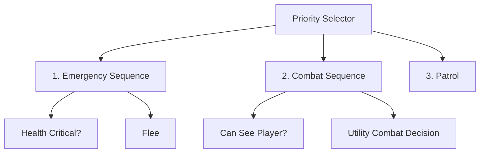

# Narasi Game Cerdas - Pertemuan 06

## Behavior Tree & Utility-Based AI

Sumber: markdown/pert06-behavior-tree-and-utility-ai.md

---

## Slide 001 - Behavior Tree & Utility-Based AI

### Narasi

Pada pertemuan sebelumnya, kita telah membahas Finite State Machine sebagai fondasi pengambilan keputusan sederhana pada NPC. Ketika kompleksitas perilaku meningkat, struktur berbasis state tunggal mulai menghadapi keterbatasan dalam hal skalabilitas, debugging, dan pemeliharaan kode. Untuk mengatasi tantangan tersebut, industri game modern beralih ke pendekatan yang lebih modular dan adaptif, yaitu **Behavior Tree** dan **Utility-Based AI**. Kedua kerangka kerja ini memisahkan logika kontrol dari data keadaan, sehingga NPC dapat merespons perubahan lingkungan secara dinamis tanpa memerlukan penulisan kondisi `if-else` yang berlebihan.

**Behavior Tree** menyusun alur keputusan menggunakan hierarki node yang dieksekusi secara rekursif, mulai dari root hingga leaf node. Setiap node memiliki status keberhasilan atau kegagalan yang menentukan arah traversal pohon. Di sisi lain, **Utility-Based AI** tidak bergantung pada jalur eksak, melainkan menghitung nilai numerik untuk setiap opsi aksi yang tersedia. Sistem akan menilai kondisi permainan secara simultan, menjumlahkan bobot faktor lingkungan, dan memilih tindakan dengan skor tertinggi. Pendekatan ini sangat efektif untuk skenario di mana NPC perlu menyeimbangkan beberapa prioritas sekaligus, seperti bertahan hidup, mengejar target, atau mencari sumber daya.

Dalam konteks pengembangan game menggunakan `` `Unity 6` `` dan bahasa pemrograman `` `C#` ``, kedua metode ini dapat diintegrasikan ke dalam arsitektur ECS atau komponen MonoBehaviour yang terstruktur. Implementasinya menuntut pemahaman tentang manajemen memori, update loop, dan komunikasi antar-sistem agar performa tetap stabil saat jumlah NPC bertambah. Fokus kita kali ini adalah memahami prinsip dasar struktur perilaku dan mekanisme penilaian aksi, sehingga mahasiswa dapat memilih pendekatan yang paling sesuai dengan kebutuhan desain gameplay sebelum masuk ke tahap coding.

### Inti yang Harus Ditekankan

- Pergeseran paradigma dari FSM menuju struktur keputusan yang lebih modular (**Behavior Tree**) dan sistem evaluasi dinamis (**Utility-Based AI**).
- Perbedaan mendasar antara eksekusi jalur hierarkis versus perhitungan skor berbasis konteks lingkungan.
- Persiapan konseptual untuk menerjemahkan kedua framework tersebut ke dalam komponen `` `C#` `` yang reusable di `` `Unity 6` ``.

### Transisi ke Slide Berikutnya

Agar proses belajar terarah dan terukur, mari kita tinjau capaian pembelajaran yang akan dicapai setelah menyelesaikan pembahasan materi ini. Poin-poin tersebut akan menjadi panduan utama dalam mendesain, mengimplementasikan, dan mengevaluasi kedua sistem AI tersebut secara praktis.

---

## Slide 002 - Capaian Pembelajaran

### Narasi

Pada slide ini, kita menetapkan lima kompetensi inti yang akan Anda kuasai setelah menyelesaikan pertemuan ini. Poin pertama dan kedua berfokus pada **Behavior Tree** sebagai struktur pengambilan keputusan hierarkis. Anda tidak hanya akan memahami cara kerja setiap **node**, tetapi juga bagaimana `selector`, `sequence`, `decorator`, `condition`, dan `action` saling terhubung untuk menghasilkan alur perilaku NPC yang dinamis. Status node seperti `Success`, `Failure`, dan `Running` menjadi kunci dalam mengontrol eksekusi logika secara real-time di dalam game engine tanpa mengganggu thread utama.

Kompetensi ketiga mengarahkan Anda pada pendekatan kuantitatif melalui **Utility-Based AI**. Di sini, setiap opsi tindakan akan diberi nilai numerik berdasarkan kondisi permainan terkini, memungkinkan NPC membuat pilihan yang lebih adaptif daripada sekadar mengikuti aturan baku. Poin keempat mengajak Anda membandingkan secara konseptual antara **Finite State Machine**, **Behavior Tree**, dan **Utility AI**, sehingga Anda dapat memilih arsitektur yang paling efisien sesuai kompleksitas skenario game. Terakhir, poin kelima menekankan implementasi praktis di **Unity** menggunakan C#, di mana teori struktur pohon dan sistem skor utility diterjemahkan menjadi komponen kode yang teruji dan terukur.

Penguasaan kelima capaian ini akan membentuk fondasi desain AI game yang scalable. Anda diharapkan mampu melihat NPC bukan sebagai kumpulan percabangan statis, melainkan sebagai agen cerdas yang menyusun keputusan melalui komposisi node atau kalkulasi preferensi kontekstual.

### Inti yang Harus Ditekankan

- Struktur **Behavior Tree** mengandalkan komposisi node hierarkis, bukan percabangan linear, untuk mengelola kompleksitas perilaku NPC dengan mudah dimodifikasi.
- Mekanisme **utility score** mengubah keputusan kualitatif menjadi perhitungan kuantitatif yang responsif terhadap perubahan lingkungan dan prioritas NPC.
- Pemilihan arsitektur AI harus didasarkan pada trade-off antara kemudahan ekstensi, performa runtime, dan tingkat interaksi antar-entity dalam scene.

### Transisi ke Slide Berikutnya

Sebelum masuk ke detail teknis Behavior Tree dan Utility AI, kita akan meninjau kembali bagaimana **Finite State Machine** mengatur perpindahan state pada NPC, serta mengidentifikasi titik lemahnya ketika jumlah perilaku bertambah. Pemahaman ini akan menjadi landasan mengapa arsitektur baru diperlukan dalam pengembangan game modern.

---

## Slide 003 - Review FSM dan Tantangan Kompleksitas

### Narasi

Mari kita tinjau kembali **Finite State Machine** atau **FSM**. Dalam arsitektur AI game, FSM bekerja dengan mengelola satu **state aktif** pada setiap momen, lalu berpindah ke state lain ketika kondisi pemicu terpenuhi. Sebagai contoh klasik, sebuah NPC dapat didefinisikan dengan perilaku dasar seperti `` `Patrol` ``, `` `Chase` ``, `` `Attack` ``, dan `` `Flee` ``. Pendekatan ini sangat efisien ketika jumlah state sedikit dan aturan transisinya bersifat linear atau jelas.

Namun, kompleksitas gameplay nyata jarang berhenti di empat perilaku tersebut. Ketika kita menyisipkan mekanisme pertahanan atau dukungan seperti `` `Heal` ``, `` `Reload` ``, `` `Search` ``, hingga `` `TakeCover` ``, jumlah hubungan antarkeadaan akan melonjak drastis. Setiap state baru berpotensi memicu kombinasi transisi yang saling bersilangan, sehingga diagram FSM menjadi sangat padat dan sulit dilacak alurnya. Fenomena ini sering disebut sebagai **combinatorial explosion** dalam desain sistem.

Untuk meredam kekacauan tersebut, pengembang biasanya menerapkan **Hierarchical FSM** yang mengelompokkan state ke dalam sub-machine terpisah. Meskipun struktur ini membantu penyederhanaan visual, fondasinya tetap bergantung pada logika percabangan yang kaku. Pertanyaan kritis yang muncul adalah: bagaimana kita dapat memperluas perilaku NPC tanpa membuat aturan keputusan menjadi rumit, redundan, dan sulit di-maintain?

Di sinilah **Behavior Tree** dan **Utility-Based AI** hadir sebagai alternatif yang mengubah cara kita mengorganisir logika. Alih-alih mengandalkan tabel transisi statis, kedua pendekatan ini memanfaatkan struktur node berjenjang atau perhitungan skor dinamis untuk mengarahkan aksi NPC. Memahami keterbatasan FSM memberikan landasan yang kuat sebelum kita beralih ke arsitektur decision-making yang lebih adaptif.

### Inti yang Harus Ditekankan

- FSM ideal untuk sistem dengan state terbatas, tetapi mengalami **combinatorial explosion** saat fitur gameplay bertambah.
- **Hierarchical FSM** meningkatkan modularitas, namun tetap menghadapi tantangan skalabilitas dan pemeliharaan kode jangka panjang.
- Fokus utama mahasiswa sekarang adalah menyadari mengapa struktur decision-making tradisional perlu digantikan oleh pendekatan yang lebih modular dan terukur.

### Transisi ke Slide Berikutnya

Sebelum kita membedah struktur node Behavior Tree dan mekanisme scoring Utility AI, mari kita letakkan decision-making pada peta besar pipeline AI game, serta lihat bagaimana data dari perception dan memory mengalir menuju sistem eksekusi.

---

## Slide 004 - Posisi Decision Making dalam Game AI

### Narasi

Dalam pengembangan agen cerdas untuk game, perilaku NPC tidak dihasilkan oleh satu algoritma tunggal, melainkan oleh serangkaian komponen yang bekerja secara berurutan membentuk sebuah pipeline keputusan. Arsitektur ini dapat dipetakan menjadi lima tahap utama yang saling terhubung:

1. **`Perception`** berfungsi sebagai antarmuka sensorik agen. Komponen ini mengumpulkan data mentah dari lingkungan, misalnya mendeteksi keberadaan pemain melalui `raycast`, `trigger volume`, atau sistem audio spatial.
2. **`Memory`** atau sering disebut **`blackboard`** bertindak sebagai pusat penyimpanan konteks. Data hasil persepsi disimpan di sini untuk melacak informasi krusial seperti posisi terakhir target, cooldown kemampuan, atau status lingkungan, sehingga agen tidak kehilangan konteks saat objek keluar dari jangkauan sensor langsung.
3. **`Decision Making`** adalah inti pemrosesan logika. Sistem ini membaca keadaan dari memory, mengevaluasi opsi yang tersedia, dan menentukan strategi perilaku yang paling tepat pada momen tersebut.
4. **`Navigation / Movement`** menerjemahkan pilihan strategis menjadi rencana pergerakan teknis. Sistem ini menghitung jalur optimal, melakukan `obstacle avoidance`, dan mengarahkan agen menuju koordinat target yang ditetapkan oleh decision maker.
5. **`Action / Animation`** menerima sinyal eksekusi akhir dan mengaktifkan interaksi gameplay serta animasi karakter yang sesuai, seperti serangan melee, `reload`, atau gerakan evasive.

Perhatikan bahwa **Behavior Tree** dan **Utility-Based AI** secara spesifik menempati ruang lingkup komponen `Decision Making`. Keduanya tidak menangani pengumpulan sensor atau perhitungan jalur fisik, melainkan fokus murni pada seleksi strategi. Output dari kedua pendekatan ini berupa arahan perilaku yang langsung disalurkan ke sistem navigasi dan animator. Pendekatan modular ini sangat krusial karena memisahkan tanggung jawab antar-sistem. Ketika kita mendesain tree atau mengatur bobot utility, kita hanya memanipulasi logika di dalam kotak decision making tanpa perlu mengganggu stabilitas sistem pergerakan atau animasi. Komunikasi antar-komponen umumnya berjalan melalui penulisan data ke `blackboard` atau pengiriman `event` terstruktur, yang menjaga decoupling dan memudahkan iterasi desain sebelum kita masuk ke implementasi strukturnya.

### Inti yang Harus Ditekankan

- Arsitektur agen cerdas bersifat modular, terdiri dari lima tahap berurutan mulai dari persepsi, memori, pengambilan keputusan, navigasi, hingga eksekusi aksi.
- **Behavior Tree** dan **Utility-Based AI** secara eksplisit berada di komponen `Decision Making`, bertugas memilih strategi berdasarkan data sensor dan konteks yang tersimpan di `blackboard`.
- Pemisahan tanggung jawab ini memungkinkan skalabilitas tinggi; perubahan logika keputusan tidak merusak sistem navigasi atau pipeline animasi.
- Komunikasi antar-komponen berjalan melalui `blackboard` atau `event`-driven messaging yang menjaga decoupling dan mempercepat proses debugging behavior NPC.

### Transisi ke Slide Berikutnya

Dengan pemahaman bahwa decision making adalah otak yang menerima input lingkungan dan mengeluarkan arahan perilaku, langkah selanjutnya adalah melihat bagaimana otak tersebut disusun secara terstruktur. Kita akan beralih ke konsep **Behavior Tree**, yang memecah kompleksitas keputusan menjadi hierarki node yang mudah dibaca, diuji, dan direuse.

---

## Slide 005 - Konsep Behavior Tree

### Narasi

Behavior Tree (BT) menawarkan pendekatan terstruktur untuk mengimplementasikan komponen **Decision Making** dalam game AI. Alih-alih menulis rangkaian kondisi `if-else` yang kaku, BT menyusun perilaku agent sebagai hierarki node yang saling terhubung. Struktur ini memungkinkan NPC merespons perubahan lingkungan secara dinamis tanpa memerlukan penulisan ulang logika inti.

Secara praktis, Anda dapat memandang Behavior Tree sebagai kumpulan modul perilaku yang dapat dirakit ulang. Developer tidak perlu membangun skrip baru untuk setiap musuh atau karakter non-pemain. Cukup susun blok perilaku standar seperti `Search`, `Hide`, atau `Attack`, lalu gabungkan sesuai kebutuhan desain level. Pendekatan modular ini mempercepat iterasi dan memudahkan pemeliharaan kode saat mekanik game berubah.

Alur eksekusi Behavior Tree mengikuti langkah-langkah berikut:
1. Evaluasi dimulai dari **root** dan menelusuri cabang ke bawah.
2. Node pengatur alur (seperti selector atau sequence) menentukan prioritas atau urutan child node.
3. Leaf node paling bawah memeriksa kondisi lingkungan atau menjalankan aksi konkret.
4. Setiap node mengembalikan status ke parent-nya untuk mengendalikan keputusan selanjutnya.
5. Subtree yang telah divalidasi dapat di-cache atau dipanggil ulang oleh node lain tanpa evaluasi ulang.

Contoh konkret terlihat pada subtree `Attack`. Sebelum NPC benar-benar menyerang, subtree ini pertama kali memeriksa visibilitas target melalui sensor, lalu memvalidasi jarak tempuh. Jika kedua syarat terpenuhi, aksi serangan dijalankan. Jika tidak, subtree mengembalikan status kegagalan dan parent node akan mengalihkan fokus ke alternatif lain seperti `Patrol` atau `Flee`. Mekanisme ini memastikan NPC tidak pernah terjebak dalam loop aksi yang tidak valid.

Dalam pipeline game AI, Behavior Tree berperan sebagai jembatan antara input persepsi dan output motorik. Setelah decision making menyelesaikan evaluasi tree, hasil akhir diteruskan ke komponen Navigation untuk menghitung jalur, serta ke komponen Animation untuk memicu klip gerak yang sesuai. Koordinasi antar-sistem ini menghasilkan perilaku NPC yang terasa alami, responsif, dan konsisten dengan aturan dunia game.

### Inti yang Harus Ditekankan

- Behavior Tree adalah struktur hierarkis yang mengevaluasi perilaku dari root menuju leaf node.
- Node pengatur alur mengatur prioritas atau urutan eksekusi child tanpa menyimpan logika aksi.
- Setiap node wajib mengembalikan status ke parent untuk mengendalikan keputusan selanjutnya.
- Subtree bersifat modular, dapat direuse, dan menyederhanakan debugging perilaku kompleks.
- BT mengintegrasikan data sensorik dengan sistem navigasi dan animasi secara terkoordinasi.

### Transisi ke Slide Berikutnya

Karena setiap node dalam tree harus mengembalikan status kepada parent-nya, memahami makna status tersebut menjadi fondasi penting. Di slide berikutnya, kita akan membahas tiga status operasional—Success, Failure, dan Running—serta bagaimana status Running memengaruhi eksekusi aksi yang membutuhkan waktu lebih dari satu tick.

---

## Slide 006 - Success, Failure, dan Running

### Narasi

Dalam Behavior Tree, setiap node tidak hanya menjalankan perintah, tetapi juga wajib melaporkan hasil evaluasinya kembali ke parent melalui sistem status. Status ini berfungsi sebagai protokol komunikasi yang mengatur alur eksekusi dari atas ke bawah maupun sebaliknya. Terdapat tiga status dasar yang menjadi tulang punggung mekanisme ini: **Success**, **Failure**, dan **Running**.

**Success** menandakan bahwa prasyarat terpenuhi atau aksi telah mencapai tujuan yang ditetapkan. Contohnya, ketika NPC berhasil menempuh jarak ke waypoint target, node pergerakan akan mengembalikan status sukses. Di sisi lain, **Failure** muncul ketika kondisi awal tidak dipenuhi atau aksi mengalami halangan, seperti saat deteksi player gagal karena objek terhalang tembok atau player berada di luar radius pandang.

Poin kritis yang membedakan Behavior Tree dari pendekatan state machine konvensional adalah keberadaan status **Running**. Condition umumnya bersifat instan dan langsung menghasilkan sukses atau gagal. Namun, action yang membutuhkan durasi—seperti pergerakan karakter, animasi kombatan, atau proses pencarian jalur—tidak bisa selesai dalam satu langkah evaluasi. Aksi tersebut akan terus mengembalikan status running selama beberapa tick hingga tugas tuntas atau dibatalkan.

Implikasi praktisnya sangat signifikan terhadap desain AI NPC. Ketika sebuah aksi seperti Chase terpilih oleh node selector, tree tidak serta merta melompat ke perilaku alternatif. Selama status running aktif, seluruh subtree yang membawanya tetap terkunci pada fase tersebut. Hal ini mencegah NPC secara acak berganti perilaku di tengah jalan, sekaligus memberikan jendela waktu bagi logika tingkat tinggi untuk memantau progres atau melakukan interupsi jika situasi berubah drastis.

Pahami bahwa status bukanlah label akhir, melainkan mekanisme kontrol aliran eksekusi yang dinamis. Tanpa penguasaan konsep ini, implementasi Behavior Tree cenderung terasa putus-putus, menyebabkan NPC terjebak pada aksi yang seharusnya sudah selesai, atau justru kehilangan konteks perilaku karena tree tidak mengetahui kapan harus melanjutkan, mengulang, atau menghentikan suatu tindakan.

### Inti yang Harus Ditekankan

- Status node (**Success**, **Failure**, **Running**) adalah protokol komunikasi utama yang mengendalikan alur eksekusi Behavior Tree.
- Condition bersifat instan, sedangkan action kompleks memerlukan status **Running** untuk mempertahankan eksekusi lintas tick game loop.
- Status **Running** menjaga konsistensi perilaku NPC, mencegah pergantian aksi yang tidak terkontrol, dan memungkinkan mekanisme interupsi yang lebih halus.
- Pemahaman mendalam tentang status ini menjadi prasyarat mutlak sebelum mempelajari mekanisme pencetus evaluasi tree atau penentuan interval tick.

### Transisi ke Slide Berikutnya

Setelah memahami bagaimana status mengalir dan mengendalikan antar node, kita perlu melihat bagaimana tree tersebut secara teknis dipicu dan dievaluasi berulang kali melalui konsep **tick**. Pada slide berikutnya, kita akan membahas peran root sebagai pemantik evaluasi, interval waktu yang optimal, serta bagaimana frekuensi keputusan berdampak langsung pada responsivitas dan beban komputasi sistem AI.

---

## Slide 007 - Root, Tick, dan Evaluasi Ulang

### Narasi

Setelah memahami bagaimana sebuah node mengembalikan status `Success`, `Failure`, atau `Running` pada slide sebelumnya, kita perlu melihat bagaimana seluruh struktur pohon perilaku tersebut dijalankan secara dinamis. Proses evaluasi ini disebut sebagai `Tick`. Satu kali tick mewakili satu siklus lengkap pembacaan konteks lingkungan NPC, penelusuran node dari root, eksekusi atau kelanjutan aksi, hingga pengembalian status akhir ke induknya.

Alur eksekusi setiap tick mengikuti empat langkah terstruktur. Pertama, sistem membaca konteks NPC yang telah diperbarui oleh engine, mencakup data posisi, deteksi musuh, atau ketersediaan sumber daya. Kedua, evaluator menelusuri node sesuai aturan parent-nya, misalnya `Sequence` akan terhenti jika ada child yang mengembalikan `Failure`, sedangkan `Selector` akan melompat ke alternatif berikutnya. Ketiga, jika kondisi terpenuhi, aksi langsung dijalankan atau diteruskan dari state sebelumnya. Keempat, status hasil evaluasi dikembalikan ke node parent untuk menentukan arah pencarian di siklus berikutnya.

Dalam praktik pengembangan game, frekuensi pemanggilan tick harus disesuaikan dengan kebutuhan gameplay dan batasan performa. Tree dapat dievaluasi setiap frame untuk respons yang sangat cepat, namun pendekatan ini berisiko membebani CPU pada AI yang kompleks. Sebagai titik awal eksperimen, interval tetap seperti `0,2 detik` sering digunakan untuk menyeimbangkan beban komputasi. Penting untuk dipahami bahwa penurunan frekuensi pengambilan keputusan tidak serta-merta membuat gerakan NPC terasa patah-patah. Komponen seperti pergerakan fisik dan animasi tetap dapat diperbarui setiap frame, sehingga hanya logika tingkat tinggi yang berjalan dengan interval tertentu.

Pemahaman krusial di sini adalah memisahkan siklus berpikir AI dari siklus rendering. `Tick` bertindak sebagai otak yang mengevaluasi prioritas secara berkala, sementara motor gerak dan animator bekerja secara kontinu. Dengan pola ini, Anda dapat merancang NPC yang cerdas tanpa mengorbankan stabilita frame rate. Poin ini menjadi fondasi sebelum kita membedah komponen-komponen spesifik yang menyusun tree itu sendiri.

### Inti yang Harus Ditekankan

- `Tick` adalah satuan waktu evaluasi penuh dari root hingga leaf, bukan sekadar panggilan fungsi acak.
- Frekuensi tick (`setiap frame` vs `interval tetap`) adalah trade-off langsung antara `responsivitas AI` dan `konsumsi CPU`.
- Pisahkan logika keputusan (tick) dari logika visual (animasi/gerak); keduanya berjalan independen agar performa optimal.

### Transisi ke Slide Berikutnya

Mekanisme eksekusi tick sudah jelas, kini saatnya melihat komponen apa saja yang sebenarnya berada di dalam tree tersebut. Pada slide berikutnya, kita akan mengenal berbagai jenis node mulai dari `Root`, `Composite`, `Decorator`, hingga `Leaf`, beserta peran spesifik masing-masing dalam alur evaluasi.

---

## Slide 008 - Jenis Node Behavior Tree

### Narasi

Setelah memahami mekanisme `tick` dari root pada slide sebelumnya, langkah selanjutnya adalah mengenali komponen penyusun Behavior Tree itu sendiri. Dalam arsitektur AI game, tree dibangun dari berbagai jenis node yang memiliki peran spesifik dalam mengelola logika keputusan NPC. Secara garis besar, node-node ini dikategorikan berdasarkan fungsi dan jumlah anak yang mereka miliki.

Komponen utama Behavior Tree dapat dikelompokkan sebagai berikut:

- **Root**: Berfungsi sebagai titik masuk evaluasi. Setiap tree hanya boleh memiliki satu root, dan tugas utamanya adalah memicu eksekusi `tick` ke cabang utama. Tanpa root, tidak ada cara bagi engine game untuk memulai siklus pengambilan keputusan.
- **Composite**: Mengelola lebih dari satu child dan menentukan bagaimana hasil evaluasi dari beberapa perilaku digabungkan. Dua tipe paling umum adalah **Selector** dan **Sequence**. Selector bekerja seperti pernyataan `if-else` bertingkat, mencoba alternatif secara berurutan hingga menemukan kondisi yang terpenuhi. Sebaliknya, Sequence mensimulasikan alur prosedural, di mana semua child harus berhasil mengembalikan status `Success` agar langkah berikutnya dijalankan. Jika salah satu gagal, seluruh sequence langsung berhenti dan mengembalikan status `Failure`.
- **Decorator**: Beroperasi pada struktur satu child. Fungsinya adalah memodifikasi atau mengubah hasil evaluasi dari child tersebut tanpa mengubah logika inti perilaku. Contoh dekorator seperti **Inverter** akan membalik status keberhasilan menjadi kegagalan atau sebaliknya. **Cooldown** mencegah eksekusi berulang terlalu cepat dengan menambahkan jeda waktu, sementara **Repeat** memungkinkan pengulangan aksi tertentu hingga batas maksimum atau kondisi tertentu terpenuhi.
- **Leaf**: Tidak memiliki child sama sekali. Leaf terbagi menjadi dua kategori fungsional: **Condition** dan **Action**. Condition berperan sebagai sensor atau pengecek keadaan lingkungan, misalnya memeriksa apakah musuh berada dalam jarak tembak. Hasilnya selalu berupa status evaluasi boolean. Action, di sisi lain, adalah eksekutor yang benar-benar mengontrol NPC, seperti memanggil fungsi `MoveTo()`, memicu animasi serangan, atau menembakkan peluru.

Memahami pembagian ini penting karena struktur BT dirancang agar modular. Anda dapat menyusun ulang node leaf dan composite tanpa mengganggu dekorator atau root, selama kontrak input-output status tetap terjaga. Ini menjadikan Behavior Tree jauh lebih mudah dipelihara dibandingkan Finite State Machine tradisional ketika kompleksitas perilaku NPC meningkat.

### Inti yang Harus Ditekankan

- Peran masing-masing node (Root, Composite, Decorator, Leaf) dan aturan jumlah child-nya.
- Perbedaan konseptual antara Selector (prioritas/pilihan) dan Sequence (alur/prosedur).
- Fungsi pemisah antara Condition (sensor/pengecek) dan Action (eksekutor/perilaku).
- Modularitas BT memudahkan pengembangan dan debugging logika NPC.

### Transisi ke Slide Berikutnya

Dengan pemahaman dasar tentang jenis-jenis node, kita akan mendalami salah satu composite yang paling sering digunakan dalam desain AI game, yaitu Selector. Kita akan melihat bagaimana prioritas ditetapkan, bagaimana status Running dan Success dikelola, serta contoh penerapannya dalam urutan perilaku NPC.

---

## Slide 009 - Selector: Pemilihan Alternatif

### Narasi

Pada slide ini kita membahas **`Selector`**, salah satu jenis **Composite Node** dalam Behavior Tree yang berperan sebagai mekanisme pengambilan keputusan berbasis prioritas. Berbeda dengan node lain yang mungkin mengeksekusi semua langkah secara paralel atau menunggu kondisi spesifik tunggal, **`Selector`** bekerja seperti daftar permintaan yang diurutkan berdasarkan tingkat urgensi. Sistem akan memeriksa setiap anak (**child**) secara berurutan dari kiri ke kanan hingga menemukan cabang yang memenuhi syarat eksekusi.

Logika evaluasi pada **`Selector`** mengikuti tiga status utama Behavior Tree: `Success`, `Failure`, dan `Running`. Ketika sebuah child mengembalikan `Failure`, evaluator akan langsung melompat ke child berikutnya untuk dicoba. Jika child tersebut mengembalikan `Success`, proses evaluasi berhenti seketika dan status `Success` diteruskan ke parent node. Sebaliknya, jika ada child yang masih dalam keadaan `Running`—misalnya animasi serangan belum selesai atau pathfinding sedang menghitung rute—evaluasi dihentikan pada tick saat itu dan status `Running` dikembalikan tanpa melanjutkan ke child selanjutnya. Jika seluruh daftar anak telah diperiksa dan semuanya berakhir dengan `Failure`, maka **`Selector`** akan mengembalikan `Failure`.

Dalam implementasi game, pola ini sangat efektif untuk merepresentasikan hierarki kebutuhan NPC. Sebagai contoh, urutan prioritas `Flee`, `Attack`, `Chase`, hingga `Patrol` dapat direalisasikan dengan menempatkan masing-masing perilaku sebagai child pada satu **`Selector`**. Saat HP NPC kritis, kondisi `Flee` terpenuhi sehingga aksi pelarian dieksekusi dan sistem langsung mengabaikannya. Selama ancaman tidak ada, sistem akan melewati `Flee` dan `Attack`, lalu beralih ke `Chase` atau akhirnya `Patrol` sesuai keadaan lingkungan.

Poin krusial yang perlu dipahami adalah penempatan kondisi pada setiap cabang. Setiap aksi harus memiliki **`Condition Leaf`** yang valid sebelum dieksekusi. Menempatkan aksi seperti `Flee` tanpa prasyarat kesehatan atau deteksi ancaman di posisi pertama akan membuat node tersebut selalu mengembalikan `Success`, sehingga cabang `Attack`, `Chase`, atau `Patrol` di bawahnya tidak pernah tersentuh. Desain tree yang baik memerlukan keseimbangan antara logika prioritas dan validasi kondisi agar NPC tetap responsif namun tidak terjebak dalam loop perilaku yang tidak masuk akal.

Pemahaman mendalam tentang **`Selector`** menjadi fondasi penting dalam merancang agent yang otonom. Dengan struktur ini, pengembang dapat mengatur fallback mechanism secara eksplisit, memastikan bahwa perilaku darurat selalu mendahului aktivitas rutin, sekaligus menjaga stabilitas eksekusi tick-per-tick pada engine game.

### Inti yang Harus Ditekankan

- **`Selector`** bekerja berdasarkan prioritas urutan: mencoba child satu per satu hingga menemukan yang `Success` atau `Running`.
- Status `Failure` memicu pencobain child berikutnya, sedangkan `Success` atau `Running` menghentikan evaluasi segera.
- Penempatan **`Condition`** sangat vital; aksi tanpa syarat di urutan atas akan memblokir seluruh cabang di bawahnya.

### Transisi ke Slide Berikutnya

Setelah memahami bagaimana **`Selector`** memilih alternatif berdasarkan prioritas, langkah selanjutnya adalah mempelajari node komposit lain yang justru mengandalkan keteraturan eksekusi, yaitu **`Sequence`**. Kita akan melihat bagaimana node ini memastikan serangkaian syarat dan aksi dijalankan secara berurutan sebelum menghasilkan keberhasilan penuh.

---

## Slide 010 - Sequence: Syarat dan Urutan Aksi

### Narasi

Setelah memahami bagaimana **Selector** bekerja sebagai mekanisme pemilihan alternatif berbasis prioritas, kita kini beralih ke struktur yang sangat krusial untuk menyusun logika NPC secara terurut, yaitu **Sequence**. Berbeda dengan Selector yang mencari satu kondisi yang benar lalu segera berhenti, Sequence berfungsi sebagai penjamin eksekusi bertahap. Node ini mengevaluasi semua *child* atau cabangnya secara berurutan dari kiri ke kanan, memastikan bahwa setiap langkah sebelumnya telah berhasil sebelum melanjutkan ke langkah berikutnya.

Mekanisme evaluasi pada Sequence mengikuti aturan status yang ketat dan konsisten dengan standar Behavior Tree:
- Jika sebuah child mengembalikan status **Success**, node akan langsung melangkah ke child berikutnya dalam daftar.
- Jika child mengembalikan **Failure**, evaluasi dihentikan seketika dan node induk juga mengembalikan **Failure**, sehingga aksi lanjutan tidak pernah dijalankan.
- Untuk status **Running**, proses tick saat ini dihentikan dan status **Running** diteruskan ke parent, yang memungkinkan aksi jangka panjang seperti animasi serangan atau pergerakan lambat tetap berjalan mulus tanpa mengganggu loop decision-making game.

Mari kita lihat contoh konkret implementasinya dalam perilaku NPC penyerang. Sebuah Sequence serangan biasanya disusun sebagai berikut:
1. `CanSeePlayer?` → Mengecek apakah target berada dalam jangkauan penglihatan NPC.
2. `InAttackRange?` → Memverifikasi jarak tempuh sudah memenuhi syarat fisik untuk menyerang.
3. `AttackPlayer` → Mengeksekusi animasi dan aplikasi damage hanya jika dua kondisi sebelumnya bernilai **Success**.

Logika ini mencegah bug umum di mana NPC mencoba melakukan aksi tanpa prasyarat terpenuhi, misalnya menyerang sambil berlari menjauh atau menembak ke arah objek yang bukan pemain. Dalam perancangan Behavior Tree, urutan node dalam Sequence sangat menentukan stabilitas sistem. Sebaiknya, letakkan node pengecekan kondisi (*condition*) terlebih dahulu, diikuti node validasi state, dan akhiri dengan node aksi (*action*). Pendekatan ini menciptakan alur *guard clause* alami yang membuat arsitektur AI lebih mudah dibaca, di-debug, dan dipelihara di lingkungan pengembangan seperti Unity atau Unreal Engine.

### Inti yang Harus Ditekankan

- **Sequence** menjamin eksekusi bertahap: semua *child* harus sukses agar aksi terakhir dijalankan.
- Status **Failure** mengakhiri evaluasi seketika, sementara **Running** mempertahankan konteks antar-tick tanpa me-reset node.
- Urutan node sangat kritis; tempatkan kondisi verifikasi di depan dan aksi utama di akhir untuk menghindari logika NPC yang tidak stabil.
- Pola ini efektif sebagai mekanisme *guard clause* bawaan yang mengurangi kebutuhan pengecekan manual di dalam kode aksi.

### Transisi ke Slide Berikutnya

Dengan memahami cara kerja Sequence sebagai pengatur urutan dan Selector sebagai pemilih alternatif, langkah selanjutnya adalah membandingkan keduanya secara langsung. Kita akan melihat perbedaan respons terhadap status Success, Failure, dan Running, serta bagaimana analogi logika biner diterapkan dalam desain Behavior Tree yang lebih kompleks.

---

## Slide 011 - Selector vs Sequence

### Narasi

Setelah membahas **Sequence** sebagai rangkaian prasyarat berurutan, kita kini memperkenalkan pasangan utamanya dalam *Behavior Tree*, yaitu **Selector**. Keduanya merupakan *composite node* yang mengatur alur evaluasi berdasarkan hasil dari *child node*. Perbedaan fundamentalnya terletak pada logika pengambilan keputusan: **Sequence** bertindak sebagai gerbang **AND** yang menuntut kelengkapan, sedangkan **Selector** berfungsi sebagai mekanisme **OR** yang mencari alternatif terbaik atau cadangan.

Respons kedua node terhadap status *child* dapat diringkas sebagai berikut:
- Saat *child* mengembalikan **Success**: **Sequence** akan melanjutkan ke anak berikutnya untuk memastikan seluruh rantai terpenuhi. **Selector** langsung menghentikan evaluasi dan mengembalikan **Success** total, karena tujuan utama telah tercapai.
- Saat *child* mengembalikan **Failure**: **Sequence** segera berhenti dan menandai pohon sebagai gagal. **Selector** justru melewatkan kegagalan tersebut dan mencoba *child* berikutnya sebagai opsi pengganti.
- Saat seluruh *child* selesai: **Sequence** hanya sukses jika semua jalur berhasil. **Selector** akan gagal jika semua alternatif telah dicoba tanpa menghasilkan keberhasilan.

Poin teknis yang paling kritis adalah penanganan status **Running**. Baik **Selector** maupun **Sequence** memiliki perilaku identik saat menemui aksi yang masih berlangsung, yaitu menghentikan evaluasi *tick* ini dan mengembalikan status **Running**. Mekanisme ini bukan kebuntuan, melainkan fitur desain yang memungkinkan aksi jangka panjang berjalan asinkron. Sistem akan menahan perubahan prioritas hingga aksi tersebut menyelesaikan diri dan mengembalikan **Success** atau **Failure** pada *tick* berikutnya.

Dalam konteks *NPC behavior*, pemahaman ini mengubah cara kita merancang kecerdasan buatan. Gunakan **Sequence** untuk skenario yang membutuhkan kepatuhan ketat, misalnya karakter hanya akan melakukan serangan jika kondisi `CanSeePlayer?` dan `InAttackRange?` terpenuhi secara bersamaan. Gunakan **Selector** untuk membangun hierarki prioritas atau *fallback logic*, seperti mencoba mengejar target, namun jika terhambat rintangan atau *stamina* habis, otomatis beralih ke perilaku mengelilingi atau mundur. Pendekatan ini membuat agen game lebih adaptif terhadap dinamika lingkungan yang tidak selalu sempurna.

Dengan menguasai kontras antara kedua komposit ini, mahasiswa dapat menghindari desain logika yang terlalu kaku atau rentan terhadap *infinite loop*. Struktur tree akan menjadi lebih modular, mudah dibaca, dan siap menangani eksekusi aksi yang memakan waktu tanpa mengganggu *game loop*.

### Inti yang Harus Ditekankan

- **Sequence** menerapkan logika **AND** (semua harus berhasil), sedangkan **Selector** menerapkan logika **OR** (cukup satu berhasil).
- Status **Running** wajib dihentikan evaluasinya oleh kedua node agar aksi jangka panjang tidak terputus paksa dalam satu *tick*.
- Pilih **Sequence** untuk prasyarat ketat, dan **Selector** untuk prioritas alternatif atau *fallback behavior* NPC.

### Transisi ke Slide Berikutnya

Sekarang setelah struktur pengatur alur (*composite*) dipahami, kita akan turun ke level terkecil dalam pohon keputusan. Slide berikutnya akan membedah komponen dasar yang mengisi node-node tersebut, yaitu perbedaan mendasar antara **Condition** dan **Action**, serta bagaimana keduanya berinteraksi dengan *blackboard* dan konteks game.

---

## Slide 012 - Condition dan Action Node

### Narasi

Dalam arsitektur Behavior Tree, setiap simpul diklasifikasikan menjadi dua kategori fungsional yang memiliki tanggung jawab sangat berbeda: **Condition Node** dan **Action Node**. Membedakan kedua tipe ini sejak awal adalah fondasi utama untuk merancang sistem kecerdasan buatan NPC yang modular, scalable, dan mudah di-debug.

**Condition Node** berperan sebagai sensor atau evaluator logika. Tugasnya hanya memeriksa apakah prasyarat tertentu terpenuhi, tanpa melakukan perubahan apa pun pada dunia game. Implementasi tipikal mencakup `HealthLow` untuk mendeteksi ambang batas nyawa, atau `CanSeePlayer` yang memanfaatkan raycast dan line-of-sight check. Node ini umumnya hanya membaca data dari **Blackboard** atau **context** yang dibagikan antar node. Karena sifatnya yang pasif, outputnya selalu berupa `Success` jika kondisi benar, atau `Failure` jika salah.

Sebaliknya, **Action Node** adalah eksekutor yang benar-benar menjalankan perilaku di dalam game engine. Node ini bertanggung jawab atas tindakan nyata seperti `Patrol`, `Attack`, atau `Flee`. Berbeda dengan condition, action node dapat menghasilkan tiga status: `Success`, `Failure`, atau `Running`. Kehadiran status `Running` menandakan bahwa aksi tersebut bersifat asynchronous dan memerlukan waktu beberapa frame untuk diselesaikan, sehingga parent node tidak boleh langsung memutus evaluasi tree.

Contoh konkret terlihat pada node `MoveToTarget`. Saat dipanggil, node akan menginisiasi pergerakan karakter menuju waypoint atau target yang ditentukan. Selama proses navigasi masih berlangsung, node mengembalikan `Running` agar tree tetap aktif menunggu penyelesaian. Ketika karakter berhasil menempati posisi tujuan, status berubah menjadi `Success`. Jika jalur terblokir permanen atau target hilang, node akan segera mengembalikan `Failure` agar tree dapat beralih ke alternatif lain.

Prinsip desain yang wajib diterapkan adalah **pemisahan ketat antara pengecekan kondisi dan pelaksanaan aksi**. Dengan memisahkan logika `CanSeePlayer` dari aksi `Attack`, kita memungkinkan reuse node secara maksimal. Satu kondisi dapat dihubungkan ke berbagai aksi, dan satu aksi dapat dipicu oleh kombinasi kondisi yang berbeda. Pendekatan ini meminimalkan duplikasi struktur tree, mempercepat iterasi desain perilaku, dan menjaga keterbacaan logika keputusan NPC.

### Inti yang Harus Ditekankan

- **Condition** hanya bertugas membaca data dan menjawab ya/tidak, sedangkan **Action** bertugas mengeksekusi perubahan state atau perilaku di game engine.
- Status `Running` pada Action Node menunjukkan proses asynchronous yang berjalan lintas frame; tree tidak boleh menganggapnya sebagai akhir evaluasi.
- Terapkan **separation of concerns**: pisahkan logika pengecekan dari aksi agar node bersifat reusable, tree lebih bersih, dan tuning perilaku NPC lebih aman.

### Transisi ke Slide Berikutnya

Setelah memahami peran dasar Condition dan Action serta pentingnya pemisahan logika, kita perlu melihat bagaimana perilaku node dapat dimodifikasi tanpa mengubah strukturnya. Pada slide berikutnya, kita akan membahas **Decorator**, mekanisme yang mampu memanipulasi status evaluasi dari satu child node saja.

---

## Slide 013 - Decorator: Inverter, Cooldown, dan Repeat

### Narasi

Setelah memahami bagaimana **Condition** dan **Action** bekerja secara independen, kita beralih ke komponen yang memodifikasi perilaku node tunggal, yaitu **Decorator**. Dalam struktur Behavior Tree, decorator berfungsi sebagai pembungkus yang hanya menangani **satu child node**, sehingga perubahan logika tetap terisolasi dan mudah di-debug. Berbeda dengan selector atau sequence yang mengatur alur antar node, decorator mengubah cara evaluasi atau eksekusi dari anak langsungnya tanpa mengganggu struktur pohon utama.

Mari kita bedah empat jenis decorator yang paling sering digunakan dalam pengembangan NPC. Pertama, **Inverter** secara sederhana menukar hasil akhir antara `Success` dan `Failure`, namun tetap mempertahankan status `Running` jika child sedang dieksekusi. Ini sangat berguna ketika Anda perlu membalik logika pemeriksaan, misalnya mendeteksi bahwa player tidak terlihat untuk memicu kondisi stealth. Kedua, **Cooldown** mengontrol frekuensi pemicuan child node dengan menambahkan jeda waktu. Contoh konkretnya adalah serangan musuh yang harus menunggu 1,5 detik sebelum bisa dipanggil kembali. Selama masa pendinginan, decorator harus menentukan status apa yang dikembalikan agar tree tidak stuck atau terus-menerus mencoba mengevaluasi ulang.

Ketiga, **Repeat** memungkinkan child node berjalan berulang kali sesuai aturan tertentu, seperti mengulang rute patroli secara siklis. Namun, implementasinya memerlukan mekanisme interupsi yang jelas. Jika ada perilaku prioritas lebih tinggi muncul, repeat harus mampu menghentikan siklus saat ini dan menyerahkan kendali ke node lain. Keempat, **Timeout** membatasi durasi maksimal eksekusi child. Jika batas waktu terlewati, decorator akan mengembalikan `Failure` meskipun child belum selesai, mencegah NPC terjebak dalam aksi yang memakan waktu terlalu lama.

Secara teknis, decorator selalu dipanggil selama fase evaluasi tree. Ketika tree meminta status dari decorator, decorator meneruskan permintaan ke child-nya, lalu menerapkan logika modifikasinya sebelum mengembalikan status final ke parent node. Penting untuk diingat bahwa decorator tidak membaca atau menulis data secara langsung; mereka hanya memanipulasi aliran kontrol berdasarkan status yang diberikan oleh child.

Dalam praktik implementasi di Unity atau engine serupa, pastikan setiap decorator menyimpan state internal yang terpisah dari child node. Misalnya, timer untuk cooldown harus reset hanya ketika child benar-benar mencapai `Success` atau `Failure`, bukan saat `Running`. Kesalahan umum pada mahasiswa adalah lupa menangani status sementara saat cooldown aktif, yang menyebabkan NPC melakukan spam aksi atau macet total.

### Inti yang Harus Ditekankan

- Decorator hanya membungkus dan memodifikasi **satu child node**, menjaga modularitas tree.
- **Inverter** membalik `Success`/`Failure` tanpa mengganggu status `Running`.
- **Cooldown** dan **Repeat** memerlukan manajemen status eksplisit saat masa tunggu atau interupsi prioritas tinggi.
- **Timeout** mencegah NPC terjebak dalam aksi panjang dengan memaksa `Failure` setelah batas waktu.

### Transisi ke Slide Berikutnya

Dengan decorator yang mengatur bagaimana node dievaluasi dan diulang, langkah selanjutnya adalah memastikan node-node tersebut memiliki akses ke data yang konsisten. Pada slide berikutnya, kita akan membahas peran **Blackboard** sebagai penyimpanan konteks bersama serta bagaimana sistem **Perception** memperbarui data sensor sebelum tree mulai berjalan.

---

## Slide 014 - Blackboard dan Perception

### Narasi

Dalam arsitektur Behavior Tree, keputusan tidak pernah diambil dalam ruang hampa. Setiap node membutuhkan akses ke informasi terkini tentang lingkungan, karakter, dan status permainan. Di sinilah **Blackboard** berperan sebagai struktur data terpusat yang menyimpan konteks bersama, sehingga berbagai node dapat membaca atau menulis informasi yang sama tanpa perlu menghitung ulang data sensor secara berulang. Pendekatan ini menghindari duplikasi logika dan menjaga efisiensi memori serta CPU saat jumlah NPC meningkat.

Sebelum Behavior Tree memulai siklus evaluasinya, sistem **Perception** bekerja terlebih dahulu. Persepsi bertugas mengumpulkan data mentah dari dunia permainan, seperti deteksi garis pandang, radius pendengaran, atau pemindaian objek terdekat. Hasil pemrosesan persepsi kemudian ditulis ke dalam variabel Blackboard. Proses ini menjamin bahwa tree selalu beroperasi pada snapshot data yang segar, bukan pada cache yang sudah usang atau tidak sinkron dengan posisi aktual entitas di dunia game.

Tabel pada slide ini menunjukkan kunci konteks yang paling umum dipakai dalam NPC behavior. Variabel `canSeePlayer` dan `distanceToPlayer` menjadi input standar untuk kondisi penglihatan dan jangkauan. `health` menentukan ambang batas flee, `lastSeenPosition` menyimpan koordinat terakhir musuh terlihat untuk mengarahkan logika search, dan `currentWaypoint` memberi tahu agent tujuan pergerakan saat patroli. Sementara itu, `attackReady` berfungsi sebagai flag status yang sering berinteraksi dengan decorator cooldown, memastikan serangan tidak bisa dipicu terus-menerus tanpa jeda.

Alur pertukaran data mengikuti pipeline yang harus dijaga ketat:
1. **Perception** membaca sinyal dari engine dan memperbarui nilai di Blackboard.
2. Saat tree dievaluasi, node **Condition** hanya membaca nilai tersebut untuk menghasilkan boolean true atau false.
3. Node **Action** memanfaatkan konteks yang sama untuk menjalankan perubahan fisik, seperti memutar model, memicu animasi, atau menulis kembali flag status ke Blackboard.

Kegagalan menjaga ritme update persepsi terhadap siklus evaluasi tree akan langsung terlihat pada gameplay. NPC mungkin tetap menyerang meskipun player sudah keluar layar, atau justru berhenti bergerak karena data jarak belum diperbarui. Oleh karena itu, pemisahan tanggung jawab antara sistem persepsi yang bersifat reaktif dan Behavior Tree yang bersifat deklaratif menjadi fondasi utama NPC yang stabil dan mudah di-debug.

### Inti yang Harus Ditekankan

- Blackboard berfungsi sebagai jembatan kontekstual yang memungkinkan node Behavior Tree berbagi data lingkungan tanpa redundansi.
- Perception wajib dieksekusi sebelum tree dievaluasi agar semua kondisi dan aksi bekerja pada data terbaru.
- Condition bersifat read-only terhadap Blackboard, sedangkan Action memiliki hak tulis untuk mengubah status NPC.
- Sinkronisasi waktu antara update persepsi dan tick tree menentukan responsivitas, stabilitas, dan kemudahan debugging AI.

### Transisi ke Slide Berikutnya

Dengan konteks yang sudah tersimpan rapi dan diperbarui secara berkala, langkah selanjutnya adalah mengatur bagaimana node-node tersebut disusun menjadi hierarki yang mencerminkan prioritas kelangsungan hidup musuh. Mari kita lanjutkan ke contoh konkret desain Behavior Tree enemy yang menggabungkan flee, attack, chase, dan patrol dalam satu pohon terstruktur.

---

## Slide 015 - Desain Behavior Tree Enemy

### Narasi

Pada slide ini, kita akan menguraikan arsitektur pengambilan keputusan musuh menggunakan **Behavior Tree**. Pohon dimulai dari node **Root** yang terhubung langsung ke sebuah **PrioritySelector**. Node ini bertugas mengevaluasi seluruh cabang perilaku secara berurutan dari atas ke bawah, dan hanya menjalankan cabang pertama yang kondisinya terpenuhi. Pendekatan ini meniru hierarki kebutuhan karakter non-player, di mana insting bertahan hidup selalu mendahului agresi atau aktivitas rutin.

Setiap baris pada tabel representasi merupakan subtree yang dibungkus dalam node **Sequence**. Node ini menjamin bahwa pemeriksaan kondisi dan tindakan eksekusi berjalan secara berurutan. Jika salah satu child dalam sequence gagal, seluruh cabang dianggap gagal dan prioritas selector akan segera melompat ke cabang berikutnya. Urutan prioritas dirancang strategis: kelangsungan hidup (**Flee**) didahulukan ketika `health` rendah atau ancaman terdeteksi, diikuti oleh peluang menyerang (**Attack**) ketika player terlihat dan dalam jangkauan, kemudian pengejaran (**Chase**) untuk menutup jarak, dan terakhir perilaku default (**Patrol**) sebagai fallback jika tidak ada target aktif.

Perhatikan bahwa cabang **Attack** memiliki mekanisme tambahan berupa penundaan cooldown. Dalam implementasi Behavior Tree, hal ini biasanya ditangani oleh decorator seperti `WaitForCooldown` atau logika internal pada action node. Saat cooldown belum habis, sequence tidak langsung mengembalikan status Failure, melainkan mempertahankan posisi tempur sambil menunggu hingga flag `attackReady` bernilai true. Hal ini menjaga NPC tetap berada dalam fase pertempuran yang stabil tanpa melakukan spam serangan yang tidak realistis atau merusak keseimbangan gameplay.

Seluruh kondisi pada struktur ini bergantung pada data kontekstual yang telah dikumpulkan sebelumnya. Sistem **Perception** memperbarui **Blackboard** dengan nilai seperti `canSeePlayer`, `distanceToPlayer`, dan `threatLevel`. Ketika tree dievaluasi, condition node tinggal membaca nilai tersebut tanpa perlu melakukan perhitungan sensorik ulang. Integrasi antara sensor, konteks bersama, dan struktur pohon ini menghasilkan perilaku musuh yang responsif terhadap lingkungan, dapat diprediksi oleh desainer level, dan efisien secara komputasi karena evaluasi bersifat short-circuit.

### Inti yang Harus Ditekankan

- Urutan eksekusi ditentukan ketat oleh **PrioritySelector**, sehingga prioritas survival selalu menang atas agresi atau patroli.
- Setiap perilaku utama harus dibungkus dalam **Sequence** agar kondisi dan aksi berjalan berurutan tanpa terputus di tengah jalan.
- Mekanisme **cooldown** pada serangan dikelola melalui decorator atau logika internal agar NPC tetap responsif tanpa melanggar aturan gameplay.
- Struktur ini sangat bergantung pada data **Blackboard** yang diperbarui oleh sistem persepsi sebelum tree mulai dievaluasi.

### Transisi ke Slide Berikutnya

Setelah memahami bagaimana cabang-cabang disusun dan diprioritaskan, langkah selanjutnya adalah mengamati bagaimana evaluator Behavior Tree memproses seluruh struktur tersebut dalam satu siklus eksekusi tunggal, atau yang dikenal sebagai satu tick.

---

## Slide 016 - Penelusuran Satu Tick

### Narasi

Pada slide sebelumnya kita telah menyusun struktur **Behavior Tree** musuh menggunakan **priority selector** sebagai simpul akar. Sekarang kita akan melihat bagaimana pohon keputusan tersebut dievaluasi secara aktual dalam satu siklus pembaruan atau **tick** permainan. Evaluasi berjalan secara sekuensial dari atas ke bawah, memeriksa setiap cabang berdasarkan kondisi lingkungan terkini. Sistem akan berhenti pada cabang pertama yang berhasil dipenuhi, lalu menjalankan aksi yang terhubung dengannya.

Tabel pada slide ini memetakan empat skenario kondisi terhadap hasil evaluasi tree. Ketika musuh memiliki **HP rendah** dan mendeteksi ancaman, **Sequence Flee** langsung memenuhi syarat sehingga evaluator memilih aksi mundur. Cabang di bawahnya tidak lagi diproses karena prioritas tinggi sudah terpenuhi. Jika HP normal namun pemain terlihat dalam jarak dekat, cabang Flee gagal dicek, evaluator bergerak ke bawah hingga menemukan **Sequence Attack** yang sesuai. Logika identik terjadi saat target terlihat tetapi masih jauh, di mana sistem melewatkan Flee dan Attack sebelum akhirnya memilih **Sequence Chase**. Apabila tidak ada ancaman maupun target yang terlihat, seluruh rantai prioritas gagal dan fallback otomatis mengarah ke **Patrol**.

Mekanisme penelusuran ini menjadi fondasi responsivitas NPC terhadap dinamika arena. Setiap tick, evaluator melakukan pemeriksaan ulang terhadap seluruh node berurutan. Namun, terdapat aturan eksekusi yang harus dipahami: ketika aksi seperti **Chase** sedang berjalan, node tersebut tidak serta merta mengembalikan status Success atau Failure. Ia akan mengembalikan status **Running** selama pergerakan atau pencarian jalur belum selesai.

Status **Running** ini berfungsi sebagai jeda evaluasi. Selector tidak akan melompat ke cabang prioritas lebih rendah sampai aksi yang sedang berjalan menyelesaikan tugasnya atau mengubah kondisinya. Tanpa mekanisme ini, NPC akan mengalami perilaku terfragmentasi, misalnya berganti arah secara acak hanya karena perubahan kecil pada koordinat pemain antar-frame. Dengan memahami alur top-down dan penghentian evaluasi oleh status **Running**, kalian dapat merancang pohon keputusan yang stabil dan mudah didebug.

### Inti yang Harus Ditekankan

- Evaluasi Behavior Tree bersifat **top-down** dan berhenti pada cabang pertama yang memenuhi syarat prioritas.
- Node aksi yang sedang berjalan mengembalikan status **Running**, yang menghentikan pengecekan prioritas lain pada tick yang sama.
- Pemahaman ini mencegah perilaku NPC yang terputus-putus dan menjadi dasar pengelolaan state machine yang koheren.

### Transisi ke Slide Berikutnya

Ketika sebuah aksi mengembalikan status **Running**, pertanyaan teknis selanjutnya adalah bagaimana sistem menangani tick berikutnya. Apakah evaluator mengevaluasi ulang dari awal, atau mengingat posisi child yang sedang aktif? Mari kita bedah mekanisme **Memory**, eksekusi reaktif, dan penanganan interupsi aksi pada slide berikutnya.

---

## Slide 017 - Running, Memory, dan Interupsi

### Narasi

Pada slide sebelumnya, kita telah melihat bagaimana sebuah *composite* node dapat mengembalikan status **Running** ketika proses belum tuntas, seperti pada kasus cabang `Chase` yang masih bergerak mengejar target. Status ini bukan akhir dari evaluasi, melainkan sinyal bahwa sistem perlu melanjutkan pekerjaan tersebut pada *tick* berikutnya. Namun, cara melanjutkan proses tersebut berbeda tergantung pada implementasi *composite* yang digunakan. Terdapat dua pola utama yang sering diterapkan dalam pengembangan AI game, yaitu pendekatan **Reactive** dan **Memory**.

Pendekatan **Reactive** dirancang untuk selalu mengevaluasi ulang seluruh hierarki dari atas pada setiap *tick*. Meskipun ada *child* yang berstatus **Running**, sistem akan memeriksa kembali kondisi prioritas tinggi terlebih dahulu. Hal ini menjamin bahwa perubahan mendadak di lingkungan game langsung terdeteksi. Misalnya, ketika musuh sedang menjalankan `Chase` tetapi tiba-tiba menerima damage hingga HP-nya jatuh di bawah `threshold`, evaluasi reaktif memungkinkan cabang `Flee` untuk segera mengambil alih alur eksekusi tanpa menunggu siklus sebelumnya selesai.

Sebaliknya, pendekatan **Memory** bekerja dengan menyimpan indeks atau referensi ke *child* yang terakhir kali mengembalikan **Running**, lalu langsung melanjutkannya pada *tick* berikutnya. Strategi ini menghemat biaya komputasi karena melewatkan pengecekan ulang pada cabang-cabang di atasnya. Namun, kekurangannya terletak pada responsivitas yang lebih lambat terhadap perubahan prioritas. Dalam desain game, pilihan antara kedua pendekatan ini biasanya ditentukan oleh trade-off antara kebutuhan real-time responsiveness dan efisiensi performa pada scene dengan banyak entitas aktif.

Selain strategi penelusuran, aspek krusial lainnya adalah pengelolaan transisi antar perilaku. Ketika sistem memutuskan untuk mengganti aksi, wajib menggunakan mekanisme **abort** atau **exit** yang sesuai dengan tipe *action node*. Tanpa penanganan yang tepat, aksi lama bisa terus dieksekusi secara paralel, menyebabkan masalah seperti damage yang dihitung berulang-ulang dalam satu frame, atau animasi serangan yang tidak pernah mencapai state selesai.

Dalam implementasi praktis di engine seperti Unity, mekanisme ini biasanya dipetakan ke callback seperti `OnExit()` atau `Cancel()`. Callback tersebut bertugas mereset variabel lokal, menghentikan coroutine, dan mengembalikan node ke state idle. Dengan demikian, setiap pergantian perilaku bersifat deterministik, bersih, dan selaras dengan *game loop* yang berjalan pada interval tetap.

### Inti yang Harus Ditekankan

- Bedakan dengan jelas kapan menggunakan strategi **Reactive** versus **Memory** berdasarkan kebutuhan responsivitas dan beban komputasi AI.
- Selalu implementasikan mekanisme **abort/exit** untuk membersihkan state aksi lama dan mencegah duplikasi efek atau glitch animasi.
- Status **Running** pada *composite* memerlukan penanganan khusus di setiap *tick* agar keputusan AI tetap akurat dan tidak tertinggal oleh perubahan lingkungan.

### Transisi ke Slide Berikutnya

Memahami bagaimana *composite* mengelola memori eksekusi internal menjadi fondasi penting sebelum kita membahas bagaimana NPC menyimpan informasi dunia eksternal, seperti posisi terakhir pemain, untuk mendukung perilaku pencarian yang lebih cerdas.

---

## Slide 018 - Memory NPC dan Search

### Narasi

Dalam desain perilaku NPC yang realistis, kemampuan mengingat dunia sekitar menjadi fondasi utama agar agen tidak terlihat kaku atau lupa tujuan secara instan. Pada slide ini, kita membahas mekanisme **Memory NPC**, di mana agen menyimpan informasi lingkungan seperti posisi terakhir pemain yang terlihat. Ketika penglihatan terhadap target terputus, NPC tidak serta merta kembali ke pola default, melainkan beralih ke fase pencarian berdasarkan data yang disimpan.

Alur implementasinya dapat dipecah menjadi empat langkah kritis yang harus dieksekusi secara berurutan:
1. Saat sensor penglihatan mendeteksi pemain, sistem mencatat koordinat `lastSeenPosition` beserta timestamp pengamatan.
2. Begitu target hilang dari jangkauan pandang, nilai tersebut dijadikan tujuan navigasi untuk memulai prosedur **Search**.
3. Durasi pencarian harus dibatasi agar NPC tidak terjebak dalam loop pencarian tanpa hasil atau menguras sumber daya komputasi.
4. Setelah pencarian berhasil menemukan target kembali, gagal total, atau waktu pencarian telah habis, status target terakhir harus dihapus agar memori tidak menumpuk dan mengganggu keputusan selanjutnya.

Mekanisme ini biasanya diimplementasikan sebagai cabang khusus dalam Behavior Tree dengan urutan prioritas tertentu. Berdasarkan contoh pada slide, hierarki evaluasi berjalan dari **Flee**, **Attack**, **Chase**, hingga **Search**, sebelum akhirnya kembali ke **Patrol**. Urutan ini memastikan bahwa ancaman langsung atau peluang serangan tetap diprioritaskan, sementara pencarian hanya aktif ketika kondisi agresif dan pengejaran tidak terpenuhi. Hal ini menjaga stabilitas keputusan AI agar tidak fluktuatif setiap tick.

Penting untuk membedakan istilah **Memory NPC** dengan konsep **memory composite** yang dibahas sebelumnya. Memory composite berfokus pada pelacakan indeks child yang sedang berstatus `Running` dalam eksekusi tree, sedangkan Memory NPC adalah penyimpanan state dunia eksternal yang memengaruhi logika pengambilan keputusan. Secara praktis, pembedaan ini membantu Anda merancang komponen yang terpisah: satu untuk manajemen eksekusi node, dan satu lagi sebagai modul persepsi serta memori jangka pendek yang bisa diakses oleh berbagai action node.

### Inti yang Harus Ditekankan

- **Memory NPC** berfungsi sebagai penyimpanan state dunia eksternal, bukan pengganti mekanisme pelacakan eksekusi node pada composite.
- Batasan waktu pencarian dan pembersihan status target wajib diterapkan untuk mencegah perilaku NPC yang tidak stabil atau *infinite loop*.
- Urutan prioritas cabang (**Flee → Attack → Chase → Search → Patrol**) menjamin bahwa respons AI tetap kontekstual dan hemat komputasi.

### Transisi ke Slide Berikutnya

Setelah memahami alur logika dan prioritas keputusan pada Behavior Tree, langkah selanjutnya adalah menerjemahkan konsep tersebut ke dalam struktur kode yang konkret. Kita akan melihat bagaimana enum status, class dasar node, serta method `Tick()` dan `Abort()` disusun dalam C# untuk mendukung implementasi praktikum. Mari lanjutkan ke pembahasan struktur kode.

---

## Slide 019 - Struktur Dasar BT dalam C

### Narasi

```csharp
public enum NodeState
{
    Success, Failure, Running
}

public abstract class BTNode
{
    public abstract NodeState Tick();
    public virtual void Abort() { }
}
```

Kode di atas merupakan fondasi konseptual implementasi **Behavior Tree** dalam C#. Sebelum masuk ke logika percabangan yang kompleks, setiap sistem AI harus memiliki standar komunikasi antar komponen melalui status eksekusi dan kontrak metode yang seragam.

Enumerasi `NodeState` mendefinisikan tiga kemungkinan hasil saat sebuah node dievaluasi oleh sistem AI. Status `Success` menandakan bahwa kondisi terpenuhi atau aksi telah selesai sepenuhnya. `Failure` menunjukkan bahwa prasyarat tidak memenuhi syarat atau proses dihentikan karena kendala tertentu. Sementara itu, `Running` adalah status dinamis yang menandakan operasi masih berlangsung dan memerlukan evaluasi ulang pada frame berikutnya, seperti animasi serangan berkelanjutan atau pergerakan menuju waypoint.

Kelas abstrak `BTNode` bertindak sebagai kontrak umum yang mewajibkan setiap turunan node untuk mengimplementasikan dua metode inti:
- `Tick()` berfungsi sebagai jantung penggerak pohon perilaku. Dipanggil secara berulang setiap kali agen AI melakukan siklus pengambilan keputusan, metode ini mengeksekusi logika spesifik node dan mengembalikan nilai `NodeState`.
- `Abort()` bersifat virtual dan dirancang untuk menangani interupsi. Ketika alur eksekusi berpindah cabang secara tiba-tiba, metode ini memberi ruang bagi node untuk membersihkan state sementara, menghentikan animasi, atau membebaskan referensi objek agar tidak terjadi konflik memori atau perilaku anomali pada NPC.

Empat jenis node yang disebutkan pada slide ini masing-maris memegang peran strategis dalam arsitektur keputusan AI:
- `SelectorNode` dan `SequenceNode` berperan sebagai pengatur aliran logika dengan menyimpan koleksi anak (*children*) dan menentukan prioritas evaluasi.
- `ConditionNode` bertugas memeriksa kondisi lingkungan atau status internal karakter tanpa mengubah dunia game, hanya menghasilkan status keberhasilan atau kegagalan.
- `ActionNode` adalah tempat di mana perintah aktual diberikan kepada karakter, seperti memicu efek visual, mengubah vektor kecepatan, atau memanggil fungsi navigasi.

Kerangka ini bukan implementasi siap pakai, melainkan blueprint struktural yang akan Anda kembangkan lebih lanjut. Fokuskan pemahaman Anda pada bagaimana status `Running` memungkinkan respons real-time, serta mengapa pemisahan antara pemeriksaan (`Condition`) dan eksekusi (`Action`) meningkatkan modularitas kode AI.

### Inti yang Harus Ditekankan

- Status `Running` memungkinkan Behavior Tree menangani aksi jangka panjang tanpa mengunci loop evaluasi AI.
- Metode `Tick()` menjalankan siklus keputusan, sedangkan `Abort()` menjamin pembersihan sumber daya saat cabang perilaku berganti secara dinamis.
- Pemahaman tegas antara `ConditionNode` (hanya membaca/mengecek) dan `ActionNode` (mengubah state/gameplay) mencegah bug logika yang umum terjadi pada pemula.

### Transisi ke Slide Berikutnya

Setelah kontrak dasar setiap node dipahami, kita akan melihat bagaimana node pengatur aliran mengevaluasi anak-anaknya secara konkret. Langkah selanjutnya adalah membedah implementasi logika `Selector` dan `Sequence` dalam C#, termasuk pola iterasi evaluasi dan pentingnya melacak status aktif saat cabang berubah.

---

## Slide 020 - Logika Selector dan Sequence dalam C

### Narasi

Behavior Tree mengandalkan dua node pengatur aliran utama untuk mengambil keputusan: **Selector** dan **Sequence**. Keduanya bekerja dengan mengevaluasi daftar anak (`children`) secara berurutan setiap kali metode `Tick()` dipanggil, namun memiliki logika penghentian yang berlawanan.

Pada **Selector**, proses iterasi mencari hasil pertama yang bukan `Failure`. Implementasinya terlihat sebagai berikut:

```csharp
foreach (BTNode child in children)
{
    NodeState result = child.Tick();
    if (result != NodeState.Failure) return result;
}
return NodeState.Failure;
```
Kode ini merepresentasikan logika OR atau prioritas alternatif. Evaluasi berhenti secepatnya jika salah satu anak mengembalikan `Success` atau `Running`. Hanya jika seluruh cabang gagal, node mengembalikan `Failure`. Dalam desain NPC, pola ini cocok untuk mekanisme fallback atau pemilihan opsi berprioritas, misalnya mencoba menyerang terlebih dahulu, lalu mundur jika gagal, dan akhirnya kembali ke posisi semula.

Sebaliknya, **Sequence** menghentikan evaluasi saat menemukan hasil pertama yang bukan `Success`:

```csharp
foreach (BTNode child in children)
{
    NodeState result = child.Tick();
    if (result != NodeState.Success) return result;
}
return NodeState.Success;
```
Pola ini merepresentasikan logika AND atau eksekusi bertahap. Setiap anak harus berhasil sebelum melanjutkan ke anak berikutnya. Jika ada satu langkah yang gagal atau masih berjalan, seluruh rangkaian dihentikan dan status tersebut diteruskan ke parent. Pola ini ideal untuk merangkai aksi kompleks yang saling bergantung, seperti `Patroli -> Deteksi Target -> Gerak ke Target -> Serang`.

Perhatikan bahwa kedua loop mengevaluasi ulang dari `child` pertama setiap tick. Tanpa mekanisme pelacakan, aksi yang sedang berjalan (`Running`) akan dipanggil berulang-ulang tanpa henti, atau aksi yang sudah selesai akan di-reset secara tidak perlu. Implementasi produksi harus menyimpan referensi ke child aktif terakhir dan memanggil `.Abort()` pada child tersebut saat prioritas cabang berubah, sehingga perilaku NPC tetap stabil dan responsif terhadap perubahan kondisi lingkungan.

Gunakan intuisi ini saat menyusun hierarki BT: tempatkan `Sequence` di dalam `Selector` untuk membuat rencana bertahap yang memiliki alternatif cadangan, atau sebaliknya. Pemahaman arah aliran data dari parent ke child serta cara status `Success`, `Failure`, dan `Running` merambat ke atas merupakan fondasi utama sebelum menghubungkan tree dengan komponen engine.

### Inti yang Harus Ditekankan

- **Selector** menerapkan logika OR: berhenti di keberhasilan pertama, gagal hanya jika semua cabang gagal.
- **Sequence** menerapkan logika AND: berhenti pada kegagalan pertama, sukses hanya jika seluruh rantai berhasil.
- Evaluasi ulang dari awal setiap tick memerlukan **pelacakan status Running** dan mekanisme **pembatalan (.Abort())** agar aksi tidak terputus atau diulang secara tidak efisien.

### Transisi ke Slide Berikutnya

Setelah struktur kontrol ini mapan, langkah selanjutnya adalah mengaitkan node-node tersebut dengan komponen runtime Unity agar NPC dapat membaca sensor, menghitung jalur, dan memicu animasi secara sinkron dengan keputusan AI.

---

## Slide 021 - Integrasi BT dengan Unity

### Narasi

Behavior Tree berfungsi sebagai otak pengambilan keputusan, namun keputusan tersebut harus diterjemahkan menjadi aksi konkret di dalam mesin game. Pada lingkungan Unity, integrasi ini dicapai melalui pemetaan logika node BT ke komponen-komponen bawaan engine yang bertanggung jawab atas simulasi fisik, navigasi, dan visual.

Berikut adalah peran kunci komponen Unity dalam menggerakkan NPC berbasis Behavior Tree:
- `MonoBehaviour` bertindak sebagai penghubung utama. Komponen ini mengatur loop pembaruan sensor, memanggil `Tick()` pada root node BT, dan menyinkronkan status keputusan dengan sistem game.
- `Transform` dan `Vector3` menyediakan data spasial. Nilai posisi, rotasi, dan jarak dihitung sebelum kondisi dievaluasi, sehingga node pengecekan geometri memiliki referensi yang akurat.
- `Raycast` dipadukan dengan `LayerMask` mengimplementasikan sistem persepsi. Hasil deteksi pandangan dan penghalang diubah menjadi nilai boolean yang langsung digunakan oleh condition node pada tree.
- `NavMeshAgent` menangani eksekusi pergerakan. Ketika BT memilih aksi seperti `Patrol`, `Chase`, atau `Flee`, agen akan menerima perintah navigasi tanpa perlu menghitung pathfinding ulang setiap frame.
- `Animator` mensinkronkan state machine animasi dengan aksi logis, memastikan visual gerak dan serangan selaras dengan keputusan AI.

Implementasi praktis biasanya mengikuti pola pemanggilan API berikut pada saat node aksi dijalankan:
```csharp
// Contoh eksekusi aksi Chase dari Behavior Tree
void ExecuteChaseAction(Vector3 targetPos)
{
    agent.SetDestination(targetPos);
    animator.SetTrigger("Run");
}

// Contoh eksekusi aksi Attack
void ExecuteAttackAction()
{
    agent.isStopped = true;
    animator.SetTrigger("Attack");
    // Damage diterapkan pada event animasi, bukan setiap tick
}
```
Perhatikan bahwa logika kerusakan (`Damage`) tidak boleh dipicu setiap kali `Tick()` berjalan. Jika dilakukan begitu, NPC akan menyerang ratusan kali per detik karena frekuensi update engine sangat tinggi. Solusinya adalah mengikat aplikasi damage ke siklus animasi serangan atau menggunakan timer cooldown yang dikelola oleh blackboard BT. Pendekatan ini menjaga keseimbangan gameplay dan mencegah perilaku NPC yang tidak realistis.

Pahami bahwa keberhasilan implementasi bergantung pada pemisahan tanggung jawab yang jelas. BT hanya menjawab pertanyaan apa yang harus dilakukan, sementara komponen Unity menjawab bagaimana melakukannya. Mahasiswa harus terbiasa membaca output BT sebagai perintah tingkat tinggi, lalu menerjemahkannya ke panggilan API yang aman terhadap performa dan konsisten dengan aturan fisika game.

### Inti yang Harus Ditekankan

- Behavior Tree hanya menghasilkan keputusan abstrak; komponen Unity (`MonoBehaviour`, `NavMeshAgent`, `Animator`) yang bertanggung jawab penuh atas eksekusi dan simulasi di dunia game.
- Sinkronisasi antara logika AI dan siklus animasi/fisik wajib dilakukan untuk menghindari perilaku tidak realistis seperti serangan beruntun tanpa jeda atau gerakan yang bertabrakan dengan environment.
- Pemahaman mendalam tentang API Unity diperlukan untuk menerjemahkan kondisi dan aksi dari node BT menjadi parameter yang dapat dieksekusi secara efisien tanpa membebani performa engine.

### Transisi ke Slide Berikutnya

Setelah memahami mekanisme integrasi antara Behavior Tree dan komponen Unity, langkah selanjutnya adalah mengevaluasi kekuatan dan batasan arsitektur ini dalam skenario pengembangan nyata, serta mempelajari teknik debugging yang efektif ketika tree mulai berkembang menjadi kompleks.

---

## Slide 022 - Kekuatan, Batasan, dan Debugging BT

### Narasi

Setelah mengintegrasikan Behavior Tree ke dalam komponen Unity pada pembahasan sebelumnya, langkah kritis berikutnya adalah mengevaluasi bagaimana struktur ini berperilaku di lingkungan game yang dinamis. Behavior Tree memberikan **perilaku modular** karena setiap node dapat dikembangkan secara terpisah, memungkinkan kondisi dan aksi digunakan kembali di berbagai entitas NPC tanpa redundansi kode. Keunggulan lainnya terletak pada **prioritas terbaca**; urutan evaluasi dari root ke leaf secara eksplisit menyatakan mana yang lebih mendesak, sehingga desainer dan programmer dapat memahami logika NPC hanya dengan menelusuri struktur pohonnya.

Namun, arsitektur ini memiliki batasan teknis yang wajib diantisipasi. Seiring penambahan skenario gameplay, **tree dapat membesar** secara signifikan, yang berpotensi menurunkan performa jika setiap tick melakukan evaluasi penuh pada semua node. Urutan cabang juga sangat sensitif; pergeseran posisi satu node dapat mengubah alur eksekusi secara drastis dan menghasilkan perilaku NPC yang tidak diinginkan. Lebih rumit lagi, pengelolaan status `Running` dan mekanisme interupsi memerlukan aturan abort yang tegas. Tanpa definisi yang jelas tentang kapan aksi yang sedang berjalan harus dihentikan demi prioritas baru, NPC dapat terjebak dalam loop atau memicu konflik animasi dan navigasi.

Dalam siklus pengembangan, debugging Behavior Tree menuntut pendekatan sistematis. Daripada mengandalkan logika manual, developer harus menampilkan jalur node aktif beserta status evaluasinya secara real-time. Pantau kondisi yang menyebabkan cabang gagal, verifikasi nilai **blackboard** beserta interval pembaruannya, dan rekam setiap pergantian aksi atau pemanggilan fungsi abort. Sebagai ilustrasi, output seperti `Attack: Failure | Chase: Running` mengindikasikan bahwa serangan ditolak oleh prasyarat tertentu, sementara pengejaran masih aktif. Sebelum menyesuaikan prioritas node, selalu verifikasi terlebih dahulu apakah kondisi pemicu telah terpenuhi atau terdapat inkonsistensi pada evaluasi logika.

### Inti yang Harus Ditekankan

- Modularity dan keterbacaan prioritas menjadikan BT mudah dikolaborasikan dan dimodifikasi.
- Pertumbuhan pohon dan penempatan cabang berdampak langsung pada stabilitas dan performa NPC.
- Debugging efektif memerlukan visualisasi jalur eksekusi, pelacakan kondisi gagal, dan monitoring blackboard.
- Aturan interupsi dan penghentian aksi `Running` harus didefinisikan eksplisit untuk mencegah konflik perilaku.

### Transisi ke Slide Berikutnya

Dengan memahami batas struktural Behavior Tree, kita dapat melihat mengapa dalam situasi yang sangat dinamis, pendekatan alternatif yang menilai kegunaan aksi secara kontekstual sering kali lebih responsif. Mari kita lanjutkan ke konsep Utility-Based AI dan bagaimana sistem ini menghitung prioritas melalui penilaian skor.

---

## Slide 023 - Konsep Utility-Based AI

### Narasi

Pendekatan **Utility-Based AI** menawarkan paradigma yang lebih cair dibandingkan struktur pohon keputusan atau state machine tradisional. Alih-alih mengandalkan kondisi biner yang kaku, agen NPC diberikan kemampuan untuk menilai setiap tindakan yang tersedia berdasarkan konteks dinis permainan. Nilai numerik atau **utility score** yang dihasilkan mencerminkan tingkat kepentingan atau kenyamanan suatu aksi pada momen tertentu, memungkinkan agen merespons perubahan lingkungan secara proporsional.

Siklus pengambilan keputusan dalam framework ini berjalan secara berulang dan dapat dipetakan melalui empat tahapan inti:

1. Identifikasi semua **aksi kandidat** yang secara teknis layak dijalankan berdasarkan status agen dan data lingkungan.
2. Hitung skor utilitas untuk setiap kandidat menggunakan fungsi evaluasi yang mempertimbangkan variabel seperti kesehatan, jarak, ancaman, atau ketersediaan sumber daya.
3. Pilih aksi dengan skor tertinggi, namun terapkan aturan **stabilisasi** untuk mencegah pergantian arah yang terlalu sensitif terhadap fluktuasi minor.
4. Eksekusi aksi terpilih, lalu tunggu interval waktu atau pemicu perubahan keadaan sebelum melakukan evaluasi ulang.

Sebagai contoh konkret, imagine sebuah NPC yang sedang patroli dan mendeteksi musuh. Sistem menghitung skor untuk tiga opsi: `Attack` bernilai 0,75 karena musuh memiliki armor tebal, `Patrol` hanya 0,10 karena sudah tidak relevan, dan `Flee` mencapai 0,90 mengingat HP agen yang kritis. Berdasarkan aturan seleksi, agen akan langsung memilih **Flee**. Namun, keberhasilan perilaku ini tidak bergantung pada mekanisme pencarian nilai maksimum, melainkan pada presisi perancangan **fungsi skor** itu sendiri.

Kualitas keputusan NPC sangat bergantung pada bagaimana bobot variabel diturunkan ke dalam persamaan utilitas. Jika fungsi hanya melihat satu aspek, misalnya HP, agen mungkin mengabaikan peluang bertahan atau justru panik berlebihan ketika ancaman sebenarnya rendah. Desainer harus memastikan bahwa fungsi utilitas merepresentasikan prioritas gameplay yang diinginkan, sehingga skor yang dihasilkan benar-benar mencerminkan niat strategis karakter.

Dalam praktik pengembangan game, pendekatan ini sangat efektif untuk menciptakan responsivitas tinggi tanpa kompleksitas debugging yang berlebihan. Perubahan parameter utilitas dapat disesuaikan secara real-time melalui editor, memungkinkan iterasi perilaku NPC yang cepat. Selain itu, arsitektur ini kompatibel dengan sistem adaptif, di mana agen dapat mempelajari penyesuaian bobot utilitas seiring bertambahnya pengalaman bermain, menjadikannya fondasi yang solid untuk AI generasi berikutnya.

### Inti yang Harus Ditekankan

- Utility-Based AI menggantikan kondisi ya/tidak dengan **skor numerik kontinu** yang menilai kelayakan aksi berdasarkan konteks permainan.
- Proses keputusan bersifat siklis: identifikasi aksi → hitung skor → seleksi tertinggi dengan stabilisasi → eksekusi → evaluasi ulang.
- Kualitas perilaku NPC ditentukan oleh akurasi **fungsi utilitas**, bukan sekadar algoritma pemilih nilai maksimum.
- Mekanisme **stabilisasi** wajib diterapkan untuk menghindari perilaku NPC yang tidak stabil atau berganti aksi akibat noise pada skor.

### Transisi ke Slide Berikutnya

Meskipun skor utilitas memberikan gradasi yang lebih halus dibanding kondisi biner, perubahan nilai bertahap belum tentu menghasilkan transisi perilaku yang mulus. Ketika dua kurva skor saling berpotongan, pilihan aksi tetap dapat berganti secara tiba-tiba. Mari kita bandingkan secara langsung karakteristik keputusan berbasis ambang batas dengan pendekatan skor utilitas pada slide berikutnya.

---

## Slide 024 - Kondisi Biner vs Utility Score

### Narasi

Dalam pengembangan AI game, cara kita menerjemahkan kondisi lingkungan menjadi keputusan NPC menentukan seberapa natural dan responsif karakter tersebut. Pendekatan tradisional sering mengandalkan **kondisi biner**, yaitu aturan `if-else` dengan ambang batas tegas. Contoh klasiknya adalah `if (currentHP < 30%) { execute(Flee); }`. Begitu nilai kesehatan menyentuh angka 30%, perilaku NPC langsung beralih dari patroli atau menyerang menjadi kabur. Perubahan ini bersifat diskrit dan instan, sehingga sering kali terasa kaku atau terlalu reaktif terhadap fluktuasi kecil pada variabel game.

Sistem **Utility-Based AI** mengatasi keterbatasan tersebut dengan mengganti ambang batas tajam menjadi **utility score**. Alih-alih menilai ya atau tidak, AI menghitung tingkat kepentingan setiap aksi berdasarkan bobot konteks saat itu. Kebutuhan untuk kabur tidak lagi berupa saklar on-off, melainkan kurva kontinu yang naik perlahan seiring penurunan HP, ditambah integrasi variabel lain seperti jarak musuh, ketersediaan cover, atau peluang serangan balik. Pendekatan ini memungkinkan NPC menimbang beberapa faktor secara paralel sebelum memutuskan langkah terbaik.

Namun, terdapat kesalahpahaman umum yang perlu diluruskan: skor yang berubah halus belum menjamin perilaku yang juga berubah halus. Mekanisme seleksi aksi tetap bekerja dengan prinsip memilih nilai tertinggi dari kumpulan kandidat. Ketika dua kurva skor saling berpotongan—misalnya skor `Attack` naik melampaui skor `Flee` karena musuh kehilangan posisi advantage—keputusan akan berganti secara mendadak. Keindahan sistem utilitas terletak pada granularitas evaluasinya, bukan pada kelancaran transisi eksekusinya.

Pemahaman ini krusial karena banyak pengembang mengira cukup membuat fungsi matematika yang smooth, maka NPC akan bergerak lembut. Padahal, stabilitas perilaku justru bergantung pada rancangan kurva skor, interval sampling yang konsisten, dan terkadang penambahan mekanisme hysteresis atau dampening agar NPC tidak terus-menerus berganti arah hanya karena selisih skor yang tipis. Di slide berikutnya, kita akan mempelajari bagaimana faktor-faktor gameplay yang memiliki satuan berbeda ditransformasi menjadi rentang seragam agar perbandingan skor menjadi valid dan dapat diprediksi.

### Inti yang Harus Ditekankan

- Kondisi biner menghasilkan perubahan perilaku instan di ambang batas, sedangkan utility score memberikan gradasi kepentingan yang mencerminkan konteks permainan secara utuh.
- Sistem utilitas mendukung evaluasi multi-faktor secara simultan, namun mekanisme pemilihan tetap berbasis nilai maksimum dari semua kandidat aksi.
- Perubahan nilai skor yang halus tidak otomatis menghasilkan transisi perilaku yang halus; pertukaran posisi skor tertinggi masih dapat memicu pergantian keputusan yang tiba-tiba.
- Kualitas respons NPC sangat bergantung pada konsistensi rancangan kurva skor dan pemahaman bahwa kehalusan hanya berlaku pada tahap evaluasi, bukan eksekusi.

### Transisi ke Slide Berikutnya

Setelah memahami dinamika antara skor kontinu dan keputusan diskrit, langkah praktis selanjutnya adalah menyiapkan data input yang akan dihitung. Kita akan membahas teknik normalisasi untuk menyamakan satuan berbagai faktor gameplay, lalu melihat contoh implementasinya dalam kode C# agar perbandingan skor berjalan akurat dan stabil.

---

## Slide 025 - Faktor dan Normalisasi Skor

### Narasi

Dalam arsitektur AI berbasis utilitas, langkah fondasi sebelum menyusun persamaan keputusan adalah mengidentifikasi **faktor** yang benar-benar relevan dengan konteks gameplay. Untuk NPC, faktor-faktor ini mencakup **health**, **jarak** ke target atau bahaya, **ammo** yang tersisa, **cooldown** kemampuan, ketersediaan **cover**, **jumlah rekan** dalam formasi, serta **tingkat ancaman** dari musuh terdekat. Setiap faktor merepresentasikan dimensi berbeda dari status agen dan lingkungan, namun mereka tidak lahir dalam skala yang seragam.

Masalah utama muncul ketika kita ingin menggabungkan faktor-faktor tersebut secara matematis. Kesehatan mungkin berkisar 0 hingga 100, jarak dalam satuan meter, dan amunisi dalam butir peluru. Mengalikan atau menjumlahkan nilai mentah langsung akan menyebabkan faktor dengan skala terbesar mendominasi hasil akhir, sehingga keputusan NPC menjadi bias dan tidak mencerminkan prioritas sebenarnya. Solusi standarnya adalah melakukan **normalisasi skor** ke rentang baku **0–1**.

Implementasi normalisasi pada Unity umumnya memanfaatkan fungsi pembatas seperti `Mathf.Clamp01`. Perhatikan potongan kode berikut sebagai referensi implementasi:
```csharp
float health01 = Mathf.Clamp01(
    currentHealth / maxHealth);
float nearScore = Mathf.Clamp01(
    1f - distance / referenceDistance);
```
Pada baris pertama, `currentHealth` dibagi dengan `maxHealth` untuk menghasilkan proporsi kesehatan relatif. Hasilnya kemudian dipaksa berada di antara 0 dan 1 agar nilai keluaran tidak pernah merusak logika utilitas. Baris kedua menerapkan logika invers untuk jarak: semakin kecil `distance` dibandingkan `referenceDistance`, semakin mendekati 1 nilai akhirnya. Pastikan variabel penyebut seperti `maxHealth` dan `referenceDistance` selalu dideklarasikan dengan nilai lebih besar dari nol untuk mencegah runtime exception akibat pembagian nol.

Rentang 0–1 memang menyederhanakan operasi vektor dan penimbangan bobot, tetapi konsistensi semantik tetap menjadi tantangan desain. Angka 0,8 pada faktor kesehatan bermakna “nyaris penuh”, sedangkan angka 0,8 pada faktor jarak bisa berarti “jauh dari tujuan”. Oleh karena itu, setiap aksi atau state machine harus memiliki konvensi normalisasi yang konsisten. Agen akan berperilaku lebih stabil dan prediktif ketika developer sepakat bahwa nilai tinggi selalu menandakan kondisi menguntungkan atau urgensi tinggi, tergantung konteks aksi yang sedang dievaluasi.

Praktik terbaik dalam pipeline AI game adalah memisahkan tahap ekstraksi faktor, normalisasi, dan penimbangan bobot. Pemisahan ini memungkinkan designer menyesuaikan respons NPC hanya dengan mengubah parameter `referenceDistance` atau `maxHealth` tanpa menyentuh logika inti pengambilan keputusan. Dengan fondasi normalisasi yang rapi, sistem utilitas siap menerima lapisan kurva respons di tahap selanjutnya.

### Inti yang Harus Ditekankan

- Identifikasi faktor gameplay yang benar-benar memengaruhi keputusan NPC sebelum masuk ke perhitungan utilitas.
- Normalisasi wajib dilakukan untuk menyamakan skala satuan berbeda ke rentang 0–1 agar tidak terjadi dominasi matematis.
- Gunakan fungsi pembatas seperti `Mathf.Clamp01` dan pastikan semua penyebut bernilai lebih besar dari nol.
- Konsistensi interpretasi skor antar aksi menentukan kealamian dan stabilitas perilaku agen.

### Transisi ke Slide Berikutnya

Setelah nilai faktor berhasil distandardisasi ke rentang 0–1, langkah selanjutnya adalah mengatur seberapa sensitif agen terhadap perubahan nilai tersebut. Di slide berikutnya, kita akan mempelajari bagaimana **response curve** memetakan input ternormalisasi menjadi tingkat kepentingan yang sesuai dengan karakter dan strategi NPC.

---

## Slide 026 - Response Curve

### Narasi

Setelah nilai faktor seperti kesehatan atau jarak berhasil dinormalisasi menjadi rentang 0–1, langkah selanjutnya adalah menentukan seberapa besar pengaruh nilai tersebut terhadap keputusan agen. Di sinilah **response curve** berperan. Fungsi ini memetakan input normalisasi ke tingkat kepentingan atau urgensi aksi, sehingga desainer dapat mengontrol nuansa responsivitas NPC tanpa mengubah struktur logika pengambilan keputusan.

Mari kita bedah tiga bentuk kurva dasar yang umum diterapkan dalam sistem utility-based AI:
1. **Linear menurun** dengan rumus `1 − h`. Penurunan kesehatan relatif menyebabkan kenaikan urgensi yang proporsional dan stabil sepanjang rentang. Pendekatan ini cocok untuk sistem yang menginginkan umpan balik langsung dan terprediksi.
2. **Kurva kuadratik** `(1 − h)²`. Urgensi tetap rendah saat HP mencukupi, namun melonjak tajam hanya ketika karakter mendekati kondisi kritis. Bentuk ini memberi ruang bagi NPC untuk tetap tenang atau mencari cover terlebih dahulu sebelum benar-benar panik.
3. **Threshold** atau fungsi ambang batas `h < 0,3 ? 1 : 0`. Memberikan respons biner yang tegas: di atas 30% HP tidak ada urgensi, begitu turun di bawah itu, urgensi langsung maksimal. Sangat efektif untuk sistem state machine yang memerlukan pemisahan jelas antara kondisi aman dan darurat.

Pemilihan bentuk kurva harus selaras dengan ekspektasi gameplay. Jika menginginkan transisi halus antar state, gunakan linear atau polinomial ringan. Jika menginginkan reaksi mendadak atau panic moment, pertimbangkan kuadratik atau eksponensial. Selain kurva bawaan, engine modern umumnya mendukung **kurva kustom** melalui lookup table atau fungsi matematika non-linear. Dengan kurva kustom, Anda dapat mengatur sensitivitas pada rentang spesifik, misalnya membuat agen sangat peka saat HP berada di antara 20% hingga 40%, namun kurang sensitif di luar rentang tersebut.

Pahami bahwa response curve bukan sekadar transformasi matematis. Ia merupakan tuas kontrol yang menentukan kapan sebuah faktor mulai “berbicara” dalam sistem decision making, dan seberapa keras suaranya dibandingkan faktor lain seperti jarak atau jumlah rekan.

### Inti yang Harus Ditekankan

- Response curve berfungsi memetakan nilai normalisasi 0–1 ke tingkat urgensi atau kepentingan aksi tertentu.
- Bentuk kurva (linear, kuadratik, threshold) secara langsung membentuk nuansa perilaku dan timing respons NPC.
- Kurva kustom memungkinkan penyesuaian sensitivitas pada rentang nilai spesifik sesuai arsitektur gameplay.
- Pemilihan kurva harus konsisten dengan ekspektasi interaksi pemain dan stabilitas sistem decision making.

### Transisi ke Slide Berikutnya

Setelah memahami cara membentuk kurva respons, langkah praktis berikutnya adalah menerapkannya dalam perhitungan skor konkret. Kita akan melihat contoh bagaimana nilai health relatif diubah menjadi low-health score, lalu dikombinasikan dengan faktor ancaman untuk menghasilkan keputusan flee yang kontekstual dan seimbang.

---

## Slide 027 - Contoh Perhitungan Skor Flee

### Narasi

Pada slide ini, kita menerjemahkan konsep **response curve** menjadi perhitungan skor utilitas konkret untuk perilaku kabur (**flee**) pada NPC. Alih-alih bekerja dengan nilai kesehatan mentah, sistem AI memerlukan angka kepentingan yang terstandarisasi agar dapat dibandingkan dengan opsi aksi lainnya. Kita memulai dengan menghitung **`lowHealthScore`** menggunakan kurva linear menurun: **`lowHealthScore = 1 − healthPercent`**. Persamaan ini memastikan bahwa penurunan kondisi fisik NPC diterjemahkan secara proporsional menjadi peningkatan urgensi, menciptakan fondasi numerik yang stabil untuk pengambilan keputusan.

Tabel perhitungan menunjukkan bagaimana nilai tersebut berubah dalam praktik. Pada darah penuh (**100**), nilai relatifnya **1,00** menghasilkan skor urgensi **0,00**. Saat darah turun ke **70**, skor naik menjadi **0,30**, dan pada sisa **10** darah, skor mencapai **0,90**. Intuisi desainnya adalah sistem ini mencegah reaksi berlebihan terhadap damage minor, namun tetap memberikan eskalasi yang jelas seiring waktu. NPC akan cenderung mencari perlindungan secara bertahap, bukan langsung melarikan diri saat pertama kali terkena serangan ringan.

Namun, skor kesehatan internal saja tidak memadai untuk memicu aksi kabur. Dalam simulasi game, NPC yang selalu lari begitu darahnya berkurang akan terasa tidak logis jika sedang menghadapi musuh yang berada di luar jangkauan deteksi atau terkendala penghalang. Untuk mengatasi hal ini, kita menambahkan konteks lingkungan melalui perkalian dengan **`threatNearScore`**. Rumus akhirnya menjadi **`fleeScore = lowHealthScore × threatNearScore`**. Operasi perkalian ini berperan sebagai gerbang logika multivariabel: kedua kondisi harus bernilai signifikan agar aksi kabur layak dipertimbangkan oleh scheduler AI.

Jika tidak ada ancaman relevan di sekitar, variabel **`threatNearScore`** bernilai **0**, sehingga hasil akhir **`fleeScore`** otomatis nol meskipun luka yang diterima sangat parah. Dari perspektif arsitektur AI, pendekatan ini memisahkan evaluasi kondisi tubuh (**internal state**) dengan evaluasi lingkungan (**external perception**). Di engine seperti Unity, komponen **Utility Manager** atau node **Selector** dalam **Behavior Tree** akan membaca hasil perkalian ini, membandingkannya dengan skor aksi lain (misalnya menyerang atau menyembuhkan), dan memilih jalur dengan nilai tertinggi yang memenuhi syarat kelayakan.

### Inti yang Harus Ditekankan

- Gunakan kurva respons (seperti linear menurun) untuk memetakan kondisi internal NPC menjadi skor utilitas yang konsisten dan mudah dituning.
- Perkalian dengan skor konteks (**`threatNearScore`**) berfungsi sebagai filter logika yang mencegah keputusan impulsif tanpa ancaman nyata di sekitar.
- Pemisahan evaluasi kondisi tubuh dan deteksi lingkungan memungkinkan arsitektur AI yang modular, sehingga perubahan pada salah satu faktor tidak merusak keseluruhan sistem keputusan.

### Transisi ke Slide Berikutnya

Setelah memahami bagaimana kondisi internal dan lingkungan digabungkan menjadi skor kabur, kita akan menerapkan pola evaluasi skor yang sama pada aksi ofensif. Slide berikutnya akan membahas perhitungan skor jarak untuk serangan serta mengapa kedekatan fisik saja tidak cukup untuk menentukan kelayakan eksekusi sebuah serangan.

---

## Slide 028 - Contoh Skor Jarak dan Kelayakan Attack

### Narasi

Formula `nearScore = Clamp01(1 − distance / 10)` merupakan implementasi sederhana dari normalisasi jarak menjadi skala preferensi antara 0 hingga 1. Fungsi `Clamp01` menjamin bahwa hasil perhitungan tidak pernah keluar dari rentang valid, sehingga AI dapat langsung menggunakannya sebagai bobot tanpa perlu penanganan batas ekstrem. Tabel pada slide memperlihatkan hubungan invers yang jelas: semakin kecil nilai `distance`, semakin mendekati 1 skor yang dihasilkan, mencerminkan intensitas keinginan agen untuk mendekat.

Namun, nilai ini hanya merepresentasikan **preferensi lunak** (*soft preference*), bukan jaminan bahwa aksi dapat dieksekusi. Dalam arsitektur AI game, kita harus memisahkan antara apa yang diinginkan agen dan apa yang secara fisik atau mekanik mungkin dilakukan. Pada contoh serangan *melee* dengan jangkauan efektif 2 unit, target pada jarak 3 unit akan menghasilkan `nearScore` sebesar 0,70. Secara numerik terlihat cukup kuat, tetapi secara logika permainan, serangan tersebut sama sekali tidak valid karena berada di luar jangkauan senjata.

Oleh karena itu, sistem keputusan wajib menerapkan **syarat wajib** (*hard constraints*) sebelum proses seleksi aksi berlangsung. Faktor seperti verifikasi jangkauan (*inRange*), deteksi visibilitas (*visible*), dan pengecekan kesiapan kooldown atau animasi (*ready*) harus dipenuhi terlebih dahulu. Pendekatan ini mencegah agen melakukan aksi yang secara teknis mustahil di dunia simulasi, menjaga konsistensi perilaku NPC, dan menghindari error logika yang sering muncul ketika skor tunggal dijadikan satu-satunya penentu keputusan.

### Inti yang Harus Ditekankan

- `nearScore` adalah metrik preferensi berbasis jarak, bukan indikator kelayakan aksi.
- Gunakan `Clamp01` untuk menormalisasi input jarak secara aman tanpa risiko nilai negatif atau melebihi 1.
- Pisahkan secara tegas antara **faktor lunak** (bobot preferensi) dan **syarat wajib** (jangkauan, visibilitas, kesiapan).
- Validasi kondisi lingkungan dan status agen harus dijalankan sebelum skor digunakan dalam pengambilan keputusan.

### Transisi ke Slide Berikutnya

Setelah memahami bahwa skor kedekatan hanyalah salah satu komponen preferensi, langkah selanjutnya adalah menggabungkan beberapa faktor tersebut menjadi satu nilai keputusan terpadu. Kita akan melihat bagaimana operasi perkalian antar faktor dapat memperkuat atau membatalkan kelayakan sebuah aksi secara otomatis.

---

## Slide 029 - Penggabungan Faktor dengan Perkalian

### Narasi

Pada slide ini, kita membahas strategi menggabungkan beberapa faktor penilaian menjadi satu skor keputusan melalui operasi perkalian. Dalam arsitektur AI game, pendekatan ini sering dipakai untuk menyatukan preferensi lunak dengan syarat keras sekaligus. Rumus utamanya adalah `Attack = nearScore × visible × inRange × ready`. Komponen `nearScore` merepresentasikan gradasi preferensi berdasarkan jarak, sedangkan `visible`, `inRange`, dan `ready` bertindak sebagai filter biner yang hanya menerima nilai 0 atau 1.

Penggunaan perkalian di sini berfungsi sebagai gerbang logika AND yang ketat. Selama semua kondisi terpenuhi, nilai-nilai tersebut saling mengalikan dan menghasilkan skor akhir dalam rentang 0 hingga 1. Sebaliknya, jika satu saja syarat gagal—misalnya target berada di balik objek (`visible = 0`) atau skill masih dalam cooldown (`ready = 0`)—produk keseluruhan langsung jatuh ke nol. Dengan cara ini, sistem secara otomatis menolak aksi yang secara mekanik tidak mungkin dilakukan, tanpa perlu struktur percabangan kondisional yang membebani loop evaluasi.

Namun, implementasi perkalian bertingkat memerlukan perhatian terhadap stabilitas numerik dan perilaku seleksi. Ketika banyak faktor pecahan digabungkan, skor akhir dapat menyusut mendekati nol secara ekstrem, sehingga mengurangi resolusi pembedaan antar kandidat. Selain itu, skor nol bukanlah penghalang absolut. Jika seluruh kandidat dalam pool evaluasi menghasilkan skor nol karena berbagai kendala lingkungan, engine tetap harus menjalankan validasi kelayakan eksplisit sebelum menetapkan aksi, guna mencegah pemilihan target yang pada akhirnya gagal dieksekusi di runtime.

### Inti yang Harus Ditekankan

- Operasi perkalian bekerja sebagai logika AND: satu syarat gagal (0) langsung membatalkan seluruh skor.
- Kombinasi perkalian efektif untuk menggabungkan preferensi berkelanjutan dengan filter kelayakan biner.
- Terlalu banyak faktor pecahan dapat menurunkan resolusi skor dan memicu masalah presisi numerik.
- Skor nol tidak menggantikan pemeriksaan kelayakan eksplisit saat fase seleksi final.

### Transisi ke Slide Berikutnya

Setelah memahami bagaimana perkalian menangani syarat wajib secara otomatis, kita akan beralih ke alternatif yang lebih toleran terhadap variasi nilai, yaitu metode weighted sum, serta mengapa syarat wajib tetap perlu dipisahkan dari komponen penjumlahan agar tidak tergerus oleh bobot preferensi.

---

## Slide 030 - Weighted Sum dan Syarat Wajib

### Narasi

Dalam sistem pengambilan keputusan agen, sering kali terdapat beberapa motivasi yang saling bersaing. **Weighted Sum** atau penjumlahan berbobot hadir untuk menggabungkan berbagai pertimbangan tersebut menjadi satu nilai preferensi tunggal. Pendekatan ini memberikan fleksibilitas dalam menentukan prioritas, sehingga perilaku NPC dapat disesuaikan dengan desain gameplay tanpa mengubah struktur logika dasarnya.

Rumus kombinasi preferensi dapat dituliskan sebagai berikut:
```
preference = 0,6 × nearScore + 0,4 × aggressionScore
```
Dengan asumsi semua input dinormalisasi pada rentang 0 hingga 1, serta bobot bersifat nonnegatif dan berjumlah tepat 1, hasil akhir juga akan tetap berada dalam interval 0–1. Sifat normalisasi ini sangat penting karena menjaga konsistensi skala antar aksi, memudahkan proses seleksi tanpa memerlukan penskalaan ulang atau penyesuaian manual saat menambah faktor baru.

Namun, nilai preferensi murni tidak menjamin validitas eksekusi. Kita harus menyandingkannya dengan pemeriksaan kelayakan wajib melalui operasi perkalian:
```
Attack = eligible × preference
```
Variabel `eligible` bertindak sebagai gerbang logika yang bernilai 1 hanya jika seluruh prasyarat terpenuhi secara simultan. Jika ada satu syarat yang gagal, nilai `eligible` langsung menjadi 0, sehingga mengunci aksi tersebut terlepas dari seberapa besar skor preferensinya.

Perbedaan konseptual antara faktor preferensi dan syarat wajib harus dijaga ketat. Faktor seperti kedekatan atau agresivitas bersifat kontinu dan relatif, sehingga aman dijumlahkan berbobot. Sebaliknya, kondisi mutlak seperti visibilitas target tidak boleh dimasukkan sebagai salah satu suku penjumlahan. Jika visibilitas dijumlahkan bersama faktor lain, agen berpotensi menghasilkan skor tinggi secara artifisial akibat dominasi bobot faktor sekunder, padahal target sebenarnya tidak terlihat. Pemisahan ini memastikan bahwa batasan lingkungan dan aturan mekanik tetap dipatuhi sebelum mekanisme pemilihan berbasis skor aktif bekerja.

### Inti yang Harus Ditekankan

- **Weighted Sum** menyeimbangkan motivasi yang bersaing dengan memberi bobot proporsional, menghasilkan skor preferensi yang ternormalisasi pada rentang 0–1.
- **Syarat wajib** harus dipisahkan dari persamaan penjumlahan dan diterapkan sebagai gerbang logika biner (`eligible`) agar aksi tidak valid tidak pernah terpilih.
- Menambahkan kondisi mutlak ke dalam suku penjumlahan berisiko menciptakan **skor palsu**, di mana faktor dominan menutupi kegagalan prasyarat kritis.

### Transisi ke Slide Berikutnya

Konsep pemisahan antara preferensi berbobot dan kelayakan wajib ini akan langsung kita terapkan pada contoh konkret. Pada slide berikutnya, kita akan membahas model skor musuh lengkap dengan definisi variabel dan aturan kandidat untuk empat aksi dasar, sebagai bahan latihan tuning perilaku.

---

## Slide 031 - Model Skor Enemy untuk Latihan

### Narasi

Slide ini menetapkan **model skor berbasis utilitas** yang akan menjadi standar konsistensi untuk seluruh contoh implementasi AI musuh. Alih-alih mengandalkan rantai kondisional hard-coded, pendekatan ini memetakan variabel keadaan permainan ke nilai numerik, memungkinkan agen mengevaluasi preferensi aksi secara kuantitatif. Konsep ini merupakan inti dari **Utility-Based AI**, di mana keputusan dihasilkan melalui perbandingan skor yang transparan dan mudah dituning.

Sebelum sistem memilih aksi, lima variabel keadaan berikut harus dievaluasi secara berkala setiap frame atau tick keputusan:
- `h`: Kesehatan relatif musuh, dinormalisasi ke rentang 0–1.
- `n`: Jarak ternormalisasi menggunakan `Clamp01(1 − distance / 10)`, mendekati 1 saat pemain sangat dekat.
- `v`: Flag visibilitas pemain, bernilai 1 jika terlihat, 0 jika tertutup atau di luar FOV.
- `r`: Flag jangkauan serang, bernilai 1 jika pemain berada dalam radius 2 unit.
- `c`: Flag kesiapan cooldown, bernilai 1 jika serangan siap diluncurkan.

Setiap tindakan memiliki rumus utilitas khusus yang hanya aktif jika melewati **filter kelayakan** awal:
- `Attack`: Dihitung sebagai `v × r × c × n`, hanya masuk kandidat jika `v = r = c = 1`.
- `Chase`: Dihitung sebagai `v × (1 − r) × (1 − n)`, aktif saat pemain terlihat namun masih di luar jangkauan.
- `Flee`: Dihitung sebagai `(1 − h) × v × n`, dipicu oleh kesehatan kritis dan keberadaan ancaman terdekat.
- `Patrol`: Nilai konstan `0,10`, berfungsi sebagai fallback dasar selama jalur patroli tersedia.

Secara praktis, struktur ini mengajarkan bagaimana desainer menerjemahkan intuisi perilaku NPC menjadi persamaan yang deterministik. Komponen perkalian pada `Attack` dan `Chase` memastikan bahwa aksi agresif hanya bersaing ketika kondisi fisik dan mekanik terpenuhi sekaligus. Sebaliknya, komponen pengurangan pada `Flee` membuat skor meningkat secara eksponensial saat kesehatan menurun, menciptakan respons bertahan diri yang alami. Pendekatan ini juga memudahkan debugging karena kontribusi masing-masing variabel terhadap keputusan akhir dapat dilacak tanpa jejak logika bercabang yang rumit.

Perlu ditekankan bahwa tabel ini sengaja direduksi untuk keperluan pedagogis. Dalam pengembangan game komersial, faktor seperti occlusion deteksi, sistem cover, noise propagation, dan kompleksitas navigasi mesh akan mengubah distribusi skor secara drastis. Parameter ini memerlukan iterasi tuning berkelanjutan agar perilaku musuh terasa responsif dan tidak monoton.

### Inti yang Harus Ditekankan

- **Filter kelayakan mendahului kalkulasi utilitas**: aksi yang melanggar syarat fisik atau cooldown harus dikeluarkan dari pool kandidat sebelum skor dibandingkan.
- **Normalisasi dan clamping menjaga stabilitas numerik**: fungsi `Clamp01` mencegah outlier jarak merusak skala perbandingan antar aksi.
- **Skor konstan sebagai fallback preventif**: nilai tetap pada `Patrol` menjamin agen tidak terjebak dalam keadaan indecisive selama jalur eksplorasi valid.
- **Model ilustratif menuntut tuning produksi**: penyederhanaan ancaman hanya pada visibilitas dan jarak mengharuskan penambahan bobot dinamis untuk gameplay yang matang.

### Transisi ke Slide Berikutnya

Dengan kerangka skor dan variabel keadaan yang sudah baku, langkah selanjutnya adalah menguji bagaimana kombinasi input berbeda memicu perubahan keputusan. Kita akan menjalankan simulasi empat skenario konkret menggunakan rumus di atas untuk mengamati dinamika pemilihan aksi secara langsung.

---

## Slide 032 - Simulasi Keputusan Utility AI

### Narasi

Utility AI bekerja dengan menghitung nilai utilitas atau skor untuk setiap aksi yang tersedia, lalu memilih aksi dengan skor tertinggi yang memenuhi syarat eksekusi. Pada simulasi ini, kita menerapkan rumus skor dari slide sebelumnya secara langsung ke empat skenario gameplay yang berbeda. Setiap baris tabel merepresentasikan kondisi lingkungan dan status karakter, sementara kolom skor menunjukkan hasil perhitungan matematis berdasarkan variabel seperti `h`, `n`, `v`, `r`, dan `c`. Sistem mengevaluasi semua opsi secara paralel sebelum menentukan tindakan final.

Mari kita telusuri pola pengambilan keputusannya melalui tabel simulasi. Pada skenario pertama dengan kesehatan penuh dan musuh dalam jangkauan, skor `Attack` mencapai `0,90` karena semua syarat terpenuhi, sehingga mengalahkan `Flee` dan `Patrol`. Di skenario kedua, meskipun kesehatan turun drastis menjadi `20%`, aksi `Attack` tidak dihitung karena cooldown aktif, memaksa sistem memilih `Flee` dengan skor `0,72`. Skenario ketiga dan keempat menunjukkan pergeseran logika ketika jarak bertambah atau target hilang, di mana `Chase` dan `Patrol` mengambil alih sebagai pilihan optimal berdasarkan ketersediaan jalur dan visibilitas.

Poin kritis yang perlu diperhatikan adalah catatan slide mengenai kondisi kesehatan rendah dengan serangan siap. Jika kita hitung ulang menggunakan rumus dasar, `Attack` akan menghasilkan skor sekitar `0,90` sedangkan `Flee` hanya `0,80` karena faktor `(1 − h)` belum cukup mendominasi. Ini mengungkap kelemahan desain utilitas linear sederhana: tanpa penyesuaian bobot atau kurva non-linear, agen cenderung tetap agresif bahkan saat nyawanya terancam. Dalam pengembangan game, masalah ini biasanya ditangani dengan pendekatan berikut:
- Menambahkan aturan darurat atau threshold kesehatan mutlak.
- Menggunakan fungsi kurva eksponensial pada variabel kesehatan.
- Memberikan multiplier prioritas tinggi pada aksi bertahan hidup.

Pemahaman ini penting sebelum kita beralih ke implementasi strukturalnya. Anda perlu menyadari bahwa kalkulasi skor hanyalah satu tahap dalam pipeline keputusan. Tahap selanjutnya adalah membungkus kalkulasi tersebut ke dalam komponen yang memiliki validasi pra-eksekusi, mekanisme pemilihan, dan penanganan konflik skor agar perilaku agen terasa stabil dan prediktif bagi pemain.

### Inti yang Harus Ditekankan

- Utility AI memilih aksi berdasarkan skor tertinggi yang valid, bukan sekadar urutan prioritas kaku.
- Rumus linear sederhana bisa gagal memprioritaskan kelangsungan hidup pada kondisi ekstrem tanpa tuning kurva atau bobot.
- Desain utilitas harus mempertimbangkan non-linearitas dan aturan darurat agar perilaku NPC sesuai dengan ekspektasi gameplay.

### Transisi ke Slide Berikutnya

Setelah memahami bagaimana skor dihitung dan dipilih, langkah selanjutnya adalah mengemas proses tersebut ke dalam struktur kode yang modular. Kita akan melihat bagaimana setiap aksi dibungkus dengan metode validasi dan algoritma seleksi yang memastikan pergantian state berjalan mulus tanpa konflik eksekusi.

---

## Slide 033 - Utility Action dan Algoritma Seleksi

### Narasi

Dalam arsitektur **Utility-Based AI**, setiap perilaku NPC direpresentasikan sebagai objek aksi yang terstruktur. Agar sistem keputusan dapat berjalan stabil dan mudah dikembangkan, setiap aksi harus menyediakan tiga antarmuka utama: metode **`CanExecute`** untuk memeriksa kelayakan berdasarkan konteks permainan, fungsi **`CalculateScore`** yang menghitung nilai utilitas atau prioritas, serta logika pelaksanaan aksi itu sendiri. Pemisahan fase pengecekan, evaluasi, dan eksekusi ini memungkinkan penambahan atau penghapusan perilaku tanpa merusak inti engine AI.

Algoritma seleksi yang menggerakkan sistem tersebut dapat dilihat pada pseudo-code berikut:
```text
bestAction = null
bestScore = -infinity
for each action:
    if not action.CanExecute(context): continue
    score = action.CalculateScore(context)
    if score > bestScore:
        bestScore = score
        bestAction = action
if bestAction is null:
    bestAction = safeFallback
ApplyDecision(bestAction)
```
Kode ini menggambarkan urutan eksekusi standar yang berjalan setiap tick atau frame. Pertama, sistem menginisialisasi variabel penampung skor dan aksi terbaik. Kemudian, terjadi iterasi pada seluruh daftar aksi yang tersedia. Kondisi **`CanExecute`** berfungsi sebagai filter awal untuk membuang aksi yang tidak mungkin dilakukan, misalnya karena cooldown belum habis, sumber daya tidak cukup, atau target tidak terlihat. Aksi yang lolos filter langsung dievaluasi oleh **`CalculateScore`**. Sistem terus memperbarui kandidat terbaik hanya jika skor baru lebih tinggi daripada skor sebelumnya. Jika setelah seluruh iterasi tidak ada aksi yang valid, sistem secara otomatis mengarahkan NPC ke **`safeFallback`** untuk mencegah perilaku kosong atau *freeze*. Hasil akhirnya adalah satu aksi tunggal yang paling optimal berdasarkan kondisi lingkungan saat itu.

Setelah aksi terpilih, fungsi **`ApplyDecision`** bertugas mengelola pergantian perilaku. Sangat penting untuk menerapkan aturan **tie-breaker** yang konsisten, misalnya mempertahankan aksi yang sedang aktif ketika skor utilitasnya sama dan aksi tersebut masih memenuhi syarat. Praktik ini mencegah fluktuasi perilaku yang cepat dan tidak perlu (*jitter*), yang sering kali menyebabkan animasi NPC berkedip, suara menembak berulang tanpa henti, atau logika gerakan menjadi tidak stabil. Dengan struktur evaluasi yang ketat, developer dapat men-debug nilai utilitas secara terpisah sebelum dikaitkan dengan implementasi gameplay.

### Inti yang Harus Ditekankan

- Setiap aksi harus memisahkan pengecekan kelayakan (**`CanExecute`**) dari perhitungan skor (**`CalculateScore`**) agar evaluasi tetap ringan dan modular.
- Algoritma seleksi wajib menyertakan mekanisme **fallback** otomatis untuk menghindari NPC diam atau error saat tidak ada aksi yang layak dieksekusi.
- Terapkan aturan **tie-breaker** yang deterministik guna mencegah pergantian aksi berlebihan (*jitter*) ketika terdapat skor utilitas yang setara.
- Fungsi **`ApplyDecision`** berperan sebagai jembatan antara fase kalkulasi matematika dan fase eksekusi gameplay yang nyata.

### Transisi ke Slide Berikutnya

Setelah aksi berhasil dipilih melalui proses evaluasi skor, implementasi berikutnya adalah mengatur bagaimana aksi tersebut dijalankan, dipertahankan, atau dihentikan selama siklus hidup NPC. Kita akan membahas mekanisme **fallback** yang lebih spesifik serta hook siklus hidup seperti **Enter**, **Update/Tick**, dan **Exit/Abort** untuk memastikan transisi perilaku berjalan mulus tanpa mengganggu responsivitas game.

---

## Slide 034 - Fallback dan Siklus Hidup Aksi

### Narasi

Setelah algoritma seleksi pada slide sebelumnya memilih aksi berdasarkan skor tertinggi, sistem tetap membutuhkan mekanisme pengaman agar NPC tidak pernah berada dalam keadaan diam atau error ketika kandidat utama tidak dapat dieksekusi. Di sinilah konsep **Fallback** berperan. Fallback bertindak sebagai jaring pengaman yang menjamin NPC selalu memiliki perilaku dasar yang valid. Sebagai contoh, jika aksi **Patrol** memiliki skor dasar rendah seperti **0,10** karena minimnya ancaman, namun jalur patroli sedang terblokir atau tidak tersedia, sistem akan secara otomatis mengalihkan eksekusi ke aksi alternatif yang lebih aman, misalnya **Idle**. Pendekatan ini memastikan stabilitas perilaku NPC bahkan dalam kondisi lingkungan yang dinamis atau tidak terduga.

Untuk mengelola aksi tersebut secara konsisten, setiap tindakan dalam arsitektur AI game harus mengikuti siklus hidup yang terstruktur. Siklus ini umumnya dibagi menjadi tiga fase utama: `` `Enter()` ``, `` `Update()` ``, dan `` `Exit()` ``. Fase `` `Enter()` `` hanya dipanggil sekali saat aksi pertama kali dipilih oleh algoritma seleksi. Tugas utamanya adalah menyiapkan konteks awal, seperti menginisialisasi variabel tujuan, memicu animasi masuk, atau mengatur parameter sensorik. Fase `` `Update()` `` berjalan secara berulang pada setiap frame atau tick logika game, berfungsi untuk melanjutkan eksekusi aksi yang sedang aktif, seperti memperbarui posisi karakter atau memeriksa kondisi kelanjutan. Terakhir, fase `` `Exit()` `` dipicu ketika aksi selesai secara alami atau terpaksa dihentikan oleh aksi lain, bertugas membersihkan sumber daya, menghentikan animasi, dan mengembalikan NPC ke keadaan siap menerima perintah baru.

Kesalahan implementasi yang sering terjadi pada pengembangan game adalah memanggil fungsi `` `Enter()` `` secara berulang pada setiap evaluasi skor atau setiap tick. Hal ini sangat berbahaya karena akan mereset tujuan, memotong animasi yang tengah berjalan, dan menciptakan perilaku NPC yang patah-patah serta tidak imersif. Dalam praktik pengembangan game, intuisi yang harus dibangun adalah bahwa inisialisasi bersifat satu arah per pergantian aksi, sementara pemeliharaan dilakukan melalui loop `` `Update()` ``. Dengan memisahkan tanggung jawab antara setup awal dan eksekusi berkelanjutan, kita memastikan transisi antar perilaku terasa halus dan logis sesuai dengan desain gameplay.

Menggabungkan mekanisme fallback dengan manajemen siklus hidup yang ketat membentuk fondasi perilaku NPC yang tangguh. Algoritma seleksi menentukan *apa* yang harus dilakukan, sedangkan fallback menjamin *bahwa sesuatu pasti dilakukan*, sementara siklus hidup mengatur *bagaimana* aksi itu dijalankan dari awal hingga akhir tanpa gangguan yang tidak perlu. Penguasaan terhadap ketiga elemen ini akan mencegah bug perilaku umum seperti NPC yang terus-menerus berkedip, terjebak dalam loop inisialisasi, atau tiba-tiba berhenti bergerak saat pemain mendekati area tertentu.

### Inti yang Harus Ditekankan

- **Fallback** wajib ada sebagai jaring pengaman agar NPC tidak pernah kehilangan aksi valid ketika kondisi lingkungan berubah mendadak atau jalur utama terhalang.
- Siklus hidup aksi (**`Enter()`**, **`Update()`**, **`Exit()`**) harus dipisahkan secara tegas agar inisialisasi tidak mengganggu kelancaran eksekusi dan pemantauan kondisi.
- Hindari pemanggilan ulang **`Enter()`** pada setiap tick atau evaluasi skor untuk mencegah reset animasi, penghapusan progress, dan perilaku NPC yang tidak stabil.

### Transisi ke Slide Berikutnya

Ketika siklus hidup dan fallback sudah terkelola dengan baik, tantangan berikutnya muncul ketika skor dua aksi bernilai sangat mirip, sehingga NPC cenderung berganti perilaku secara berlebihan. Untuk mengatasi fluktuasi keputusan tersebut, kita perlu menerapkan aturan ketahanan perubahan dan komitmen durasi aksi yang akan dibahas pada materi selanjutnya.

---

## Slide 035 - Switching, Hysteresis, dan Commitment

### Narasi

Ketika nilai skor heuristik atau utilitas berada sangat berdekatan, sistem keputusan akan mengalami fluktuasi cepat. Contoh klasik adalah pertukaran antara **Attack** bernilai `0,51` dan **Chase** bernilai `0,50` yang terus berganti arah. Kondisi ini menyebabkan NPC terlihat gelisah, boros sumber daya komputasi, dan merusak imersi gameplay. Untuk menstabilkan perilaku, kita menerapkan empat mekanisme kontrol pada pipeline keputusan:

1. **Hysteresis**: Memberikan ambang batas toleransi agar pergantian aksi tidak terjadi karena fluktuasi kecil. Aksi baru hanya dipilih jika nilainya melampaui skor aksi aktif lebih dari `0,10`.
2. **Minimum duration**: Memaksa aksi berjalan setidaknya selama periode tertentu, misalnya `1 detik`, sebelum sistem memperbolehkan evaluasi ulang. Ini mencegah pemutusan dini yang terasa patah-patah.
3. **Decision interval**: Menetapkan frekuensi sampling keputusan. Alih-alih mengevaluasi skor setiap frame, sistem hanya melakukan perhitungan setiap `0,2 detik`. Hal ini menyelaraskan ritme berpikir AI dengan persepsi pemain dan mengurangi beban CPU.
4. **Action commitment**: Menjaga kelanjutan fase kritis eksekusi, seperti menyelesaikan animasi serangan atau mencapai titik perlindungan, sebelum mengizinkan pergantian. Namun, komitmen ini bersifat fleksibel; kondisi darurat atau validasi jalur yang hilang dapat membatalkan komitmen dan memicu interupsi instan.

Parameter-parameter tersebut berfungsi sebagai titik awal tuning. Nilai sebenarnya harus disesuaikan berdasarkan peran karakter, kesulitan permainan, dan target performa. Prinsip utamanya adalah membuat keputusan AI terasa disengaja dan responsif terhadap konteks, bukan sekadar bereaksi terhadap perubahan numerik sepele.

### Inti yang Harus Ditekankan

- Fluktuasi skor yang tipis menyebabkan **jitter** pada NPC; stabilitas harus dijaga melalui mekanisme penundaan dan ambang batas.
- **Hysteresis** mencegah pergantian aksi impulsif dengan mensyaratkan selisih skor minimal.
- **Minimum duration** dan **Decision interval** mengatur ritme eksekusi dan frekuensi evaluasi, menyeimbangkan responsivitas dengan efisiensi.
- **Action commitment** memastikan kelanjutan fase animasi/kritis, namun tetap memungkinkan interupsi darurat untuk menjaga kelayakan perilaku.

### Transisi ke Slide Berikutnya

Setelah sistem keputusan stabil, langkah selanjutnya adalah menyesuaikan bobot dan kurva utilitas untuk menciptakan karakter dengan kepribadian berbeda. Kita akan melihat bagaimana parameter ini dikonfigurasi langsung di Unity menggunakan atribut serialisasi dan ScriptableObject.

---

## Slide 036 - Personality dan Konfigurasi di Unity

### Narasi

Setelah mekanisme switching, hysteresis, dan commitment dibahas untuk menstabilkan pengambilan keputusan, fokus kita kini bergeser ke bagaimana parameter skor tersebut dapat diubah menjadi karakter atau kepribadian yang berbeda-beda. Dalam sistem **Utility-Based AI**, nilai bobot dan bentuk kurva evaluasi bukanlah angka statis yang diterapkan seragam kepada semua entitas. Dengan menyesuaikan preferensi terhadap faktor tertentu, kita dapat menghasilkan variasi perilaku yang terasa organik dan mudah dikendalikan oleh desainer.

Sebagai ilustrasi, NPC bertipe **Agresif** dapat dibuat dengan menaikkan bobot atau menggeser kurva evaluasi pada aksi **Attack**, sehingga peluangnya menang lebih sering meski risiko tinggi. Karakter **Penakut** akan merespons peningkatan urgensi **Flee** jauh lebih cepat saat deteksi ancaman muncul, sementara tipe **Defensif** akan secara konsisten memprioritaskan **TakeCover** bahkan ketika jarak ke musuh masih relatif terbuka. Perubahan ini hanya memerlukan penyesuaian data konfigurasi, tanpa perlu menulis logika kondisional baru untuk masing-masing tipe karakter.

Di ekosistem pengembangan Unity, praktik terbaik adalah memisahkan parameter tunable dari kode inti agar proses penyetelan tidak mengganggu stabilitas program. Atribut `[SerializeField]` memungkinkan kita mengekspos variabel seperti bobot, threshold, atau referensi kurva langsung ke panel **Inspector** untuk penyetelan visual secara real-time. Untuk proyek yang lebih terstruktur, menyimpan seluruh set konfigurasi aksi dan kurva dalam asset `ScriptableObject` sangat disarankan karena memungkinkan berbagi data antar banyak NPC sekaligus memudahkan version control dan kerja kolaboratif.

Pembedaan arsitektur juga wajib dilakukan antara aset konfigurasi yang bersifat global dengan status yang berubah-ubah selama permainan berlangsung. Informasi seperti cooldown terakhir, timer komitmen aksi, atau posisi target saat ini harus disimpan sebagai **status runtime per NPC**, bukan di dalam aset konfigurasi bersama. Pemisahan ini mencegah konflik data ketika beberapa NPC menggunakan profil kepribadian yang sama. Untuk tahap awal praktikum, penggunaan class C# biasa sudah cukup memadai sebelum mahasiswa beralih ke arsitektur berbasis `ScriptableObject`.

### Inti yang Harus Ditekankan

- Penyesuaian bobot dan kurva evaluasi adalah fondasi pembuatan **personalitas NPC** yang berbeda tanpa menambah kompleksitas kode.
- Gunakan `[SerializeField]` untuk ekspos parameter ke **Inspector**, dan manfaatkan `ScriptableObject` untuk konfigurasi yang dapat dibagikan dan dikelola secara terpusat.
- Pisahkan **konfigurasi statis** dari **status runtime per NPC** (cooldown, aksi aktif, timer) agar sistem tetap bersih, aman dari race condition, dan mudah diskalakan.

### Transisi ke Slide Berikutnya

Ketika parameter sudah diatur dan kepribadian NPC terbentuk, langkah selanjutnya adalah memastikan bahwa sistem berjalan sesuai harapan tanpa menghasilkan perilaku anomali atau bug logika. Pada slide berikutnya, kita akan membahas teknik **debugging** khusus untuk Utility AI, mulai dari pelacakan skor, validasi kandidat aksi, hingga identifikasi kesalahan umum seperti pergantian aksi terlalu cepat atau satu aksi yang selalu mendominasi.

---

## Slide 037 - Debugging dan Kesalahan Utility AI

### Narasi

Setelah konfigurasi bobot dan kurva kepribadian NPC selesai di Unity, langkah selanjutnya adalah memastikan bahwa sistem **Utility AI** berjalan sesuai ekspektasi. Nilai utilitas hanyalah angka abstrak yang dihasilkan oleh persamaan matematika. Tanpa mekanisme observasi yang jelas, kesalahan konfigurasi sering kali disalahartikan sebagai masalah pada pathfinding atau animasi. Oleh karena itu, transparansi internal sistem harus dibuka secara eksplisit.

Pada praktikum ini, Anda wajib menampilkan lima elemen kunci selama eksekusi: **aksi aktif**, **kandidat yang layak**, **skor setiap faktor**, **skor akhir**, serta **alasan pergantian aksi**. Dengan data ini, Anda dapat melacak mengapa sebuah keputusan diambil dan mengidentifikasi titik kegagalan dalam pipeline evaluasi. Berikut adalah pemetaan gejala umum terhadap penyebab teknis yang perlu diperiksa:

1. **Attack menembus penghalang**: Biasanya terjadi karena fungsi validasi visibilitas atau raycast tidak mengembalikan hasil `false` saat ada objek blocker di antara NPC dan target.
2. **Flee saat tidak ada ancaman**: Cek apakah faktor ancaman pada skor `Flee` terkalibrasi terlalu sensitif, sehingga noise lingkungan memicu respons lari tanpa ancaman nyata.
3. **Aksi berganti terlalu cepat**: Menandakan belum adanya mekanisme **hysteresis** atau **commitment**. Sistem perlu menunda pergantian aksi hingga selang waktu tertentu atau hingga perubahan skor melewati threshold yang signifikan.
4. **Satu aksi selalu menang**: Skala nilai antar faktor tidak seimbang, bobot konstanta mendominasi, atau kurva normalisasi tidak berfungsi. Lakukan penyesuaian skala dan uji distribusi skor secara berkala.
5. **NPC tidak bertindak**: Kandidat aksi mungkin tidak memenuhi prasyarat kelayakan, atau struktur fallback tidak terhubung dengan benar. Verifikasi kondisi awal dan jalur default pada logika pemilihan.

Untuk memantau hal-hal tersebut, manfaatkan alat bawaan Unity seperti `Console`, panel `UI debug` kustom, inspector untuk parameter runtime, serta `Gizmos` untuk memvisualisasikan area deteksi dan line-of-sight secara langsung. Penting untuk mencatat setiap pergantian aksi ke dalam log terstruktur. Evaluasi performa karakter tidak boleh bergantung hanya pada kesan visual sesaat, melainkan pada rekaman transisi state dan pola pengambilan keputusan sepanjang waktu simulasi.

### Inti yang Harus Ditekankan

- Transparansi skor dan alasan transisi aksi adalah fondasi utama dalam mendiagnosis perilaku NPC berbasis Utility AI.
- Gejala perilaku aneh hampir selalu berakar pada kalibrasi bobot, validasi konteks, atau ketiadaan mekanisme stabilitas seperti hysteresis.
- Dokumentasi log pergantian aksi lebih andal daripada pengamatan visual murni untuk menilai kualitas keputusan AI.

### Transisi ke Slide Berikutnya

Ketika sistem Utility AI sudah stabil dan dapat didebug dengan baik, kita akan mengevaluasi kapan pendekatan ini paling tepat digunakan dibandingkan alternatif lain seperti Finite State Machine atau Behavior Tree.

---

## Slide 038 - Pemilihan FSM, BT, dan Utility AI

### Narasi

Pemilihan arsitektur AI untuk NPC tidak boleh bersifat arbitrer, melainkan harus didasarkan pada kompleksitas keputusan, frekuensi perubahan perilaku, dan kebutuhan responsivitas di dalam lingkungan game. Setelah kita membahas teknik debugging skor dan stabilitas pada Utility AI, penting untuk mundur selangkah dan membandingkan tiga fondasi utama yang biasa kita terapkan di Unity atau engine sejenis: **Finite State Machine**, **Behavior Tree**, dan **Utility-Based AI**. Masing-masing memiliki filosofi evaluasi yang berbeda, dan memahami perbedaannya akan menentukan seberapa mudah Anda mengelola logika `state`, `transition`, `node`, maupun `action` saat skenario gameplay berkembang.

FSM bekerja dengan mengeksekusi satu `state` aktif sekaligus dan mengandalkan `transition` eksplisit untuk berpindah antar kondisi. Kekuatannya terletak pada keterbacaan alur eksekusi dan kemudahan pelacakan debug. Namun, ketika jumlah `state` bertambah, jumlah `transition` tumbuh secara eksponensial sehingga kode cepat menjadi sulit dipelihara. Pendekatan ini sangat cocok untuk mode permainan sederhana, loop patrol dasar, atau mekanisme yang hanya membutuhkan beberapa kondisi statis tanpa banyak variasi kontekstual.

Behavior Tree menggantikan transisi kaku dengan struktur hierarkis yang mengevaluasi `node` dari root ke leaf. Setiap node mengembalikan status sukses, gagal, atau berjalan, memungkinkan komposisi perilaku yang modular. Keunggulan utamanya adalah penanganan prioritas dan interupsi yang terstruktur, sehingga NPC dapat mempertahankan rutinitas sambil tetap merespons ancaman mendadak. Tantangannya terletak pada desain tree yang dalam, pengelolaan propagasi kegagalan, serta penempatan node interrupt agar tidak mengganggu alur utama. BT ideal untuk sistem guard, patroli bertingkat, atau setiap entitas yang memerlukan urutan eskalasi perilaku yang jelas.

Utility-Based AI menghitung `utility score` untuk semua `action` yang tersedia secara simultan, lalu memilih nilai tertinggi. Sistem ini tidak bergantung pada keadaan diskrit, melainkan pada kurva preferensi yang menilai faktor lingkungan seperti jarak, kesehatan, ketersediaan amunisi, atau posisi cover. Hasilnya adalah perilaku yang sangat adaptif dan halus, cocok untuk pertempuran dinamis, interaksi sosial, atau dunia terbuka dengan banyak alternatif taktis. Tantangan utamanya ada pada penalaan fungsi utilitas; skala bobot yang tidak seimbang akan menyebabkan satu aksi mendominasi atau NPC berganti tujuan terlalu sering. Perlu dicatat bahwa responsivitas berbasis konteks pada Utility AI tetap merupakan sistem aturan matematis, bukan pembelajaran mesin otomatis. Agent hanya mengevaluasi preferensi yang ditentukan developer, bukan mempelajari pola dari data historis.

Dalam praktik pengembangan profesional, pilihan arsitektur biasanya mengikuti skala kebutuhan gameplay. Gunakan FSM untuk prototipe cepat atau mekanik linear. Beralih ke Behavior Tree ketika Anda membutuhkan lapisan prioritas, fallback, dan penanganan interupsi yang rapi. Manfaatkan Utility AI ketika gameplay menuntut trade-off multi-faktor dan NPC perlu membuat keputusan nuansa tanpa breakpoint kaku. Penguasaan masing-masing pendekatan secara terpisah akan memastikan Anda tidak terjebak pada solusi serba guna yang justru mengurangi kontrol artistik dan teknis atas karakter virtual.

### Inti yang Harus Ditekankan

- Sesuaikan arsitektur dengan kompleksitas keputusan dan frekuensi perubahan perilaku, bukan sekadar mengikuti tren implementasi.
- FSM unggul pada kejelasan `state` dan eksekusi linear, BT kuat dalam manajemen prioritas dan interupsi modular, sedangkan Utility AI menangani banyak alternatif secara dinamis melalui perhitungan `utility score`.
- Responsivitas kontekstual pada Utility AI tetap merupakan sistem aturan matematis yang diturunkan dari kurva preferensi, bukan indikasi adanya machine learning atau adaptasi otonom.

### Transisi ke Slide Berikutnya

Setelah memahami kapan masing-masing pendekatan paling efektif, langkah selanjutnya adalah menggabungkan keunggulan struktural mereka. Kita akan melihat bagaimana Behavior Tree dapat berfungsi sebagai kerangka prioritas utama sementara Utility AI beroperasi di dalam cabang tertentu untuk pengambilan keputusan halus.

---

## Slide 039 - Kombinasi Behavior Tree dan Utility AI

### Narasi

Pendekatan hibrida menggabungkan struktur hierarkis dari **Behavior Tree** dengan fleksibilitas penilaian skor pada **Utility-Based AI**. Dalam skenario game yang kompleks, NPC tidak hanya mengandalkan pilihan biner atau state machine yang kaku, melainkan membutuhkan mekanisme yang mampu menyeimbangkan prioritas darurat dengan keputusan kontekstual yang dinamis.

Slide ini menampilkan arsitektur berbasis `Priority Selector` di tingkat root. Alur evaluasi berjalan dari atas ke bawah, dan cabang pertama yang memenuhi kondisi akan dieksekusi:



Pada cabang `Emergency Sequence`, sistem melakukan pengecekan cepat terhadap kondisi kritis seperti kesehatan NPC. Jika terpenuhi, eksekusi langsung dialihkan ke aksi `Flee` tanpa mempertimbangkan opsi lain. Ini menjamin stabilitas perilaku dan mencegah NPC terjebak dalam analisis berlebihan saat nyawanya terancam.

Jika kondisi darurat tidak aktif, alur berlanjut ke `Combat Sequence`. Di sini, sistem pertama-tama memeriksa apakah target terlihat melalui kondisi `Can See Player?`. Apabila terpenuhi, kontrol diserahkan ke node `Utility Combat Decision`. Node ini tidak lagi memilih satu aksi secara mutlak, melainkan mengevaluasi beberapa kandidat sekaligus: **Attack**, **Chase**, dan **TakeCover**. Setiap kandidat diberi skor berdasarkan faktor lingkungan, jarak, ketersediaan penutup, dan ketersediaan sumber daya. Aksi dengan skor tertinggi dipilih sebagai respons terbaik saat itu.

Integrasi teknis antara Utility AI dan Behavior Tree menuntut kepatuhan pada konvensi status node. Meskipun Utility AI bekerja dengan perhitungan probabilistik atau heuristik, node tersebut tetap harus mengembalikan status standar BT seperti `Success`, `Failure`, atau `Running`. Selain itu, node utility wajib mendeteksi dan merespons interupsi dari prioritas lebih tinggi. Jika NPC tiba-tiba menerima kerusakan berat saat sedang menghitung skor combat, eksekusi harus segera dihentikan dan beralih ke `Emergency Sequence`.

Kombinasi ini memberikan intuisi praktis yang kuat: gunakan Behavior Tree untuk mengikat logika utama, mengelola prioritas global, dan menangani transisi antar mode perilaku. Gunakan Utility AI di dalam cabang spesifik yang membutuhkan pertimbangan multi-aspek, terutama pada fase interaksi kompetitif seperti pertempuran atau negosiasi. Pendekatan ini menghasilkan NPC yang terlihat responsif tanpa mengorbankan prediktabilitas sistem.

### Inti yang Harus Ditekankan

- **Priority Selector** menjalankan evaluasi berurutan; cabang pertama yang sukses menghentikan pencarian lebih lanjut.
- **Utility AI** berperan sebagai evaluator multi-kriteria di dalam cabang tertentu, bukan pengganti struktur tree.
- Node utility wajib mengembalikan **status BT** dan mendukung mekanisme **interupsi** agar prioritas darurat tetap dominan.
- Hibridisasi ini menyeimbangkan **stabilitas logika** dengan **fluiditas keputusan** dalam skenario dinamis.

### Transisi ke Slide Berikutnya

Konsep integrasi ini menjadi fondasi langsung untuk kegiatan praktikum berikutnya, di mana kalian akan menerapkan salah satu pendekatan atau kombinasi keduanya pada scene NPC yang sama untuk mengamati perbedaan perilaku dan performa implementasinya.

---

## Slide 040 - Praktikum: NPC dengan BT atau Utility AI

### Narasi

Pada praktikum kali ini, kalian akan mengimplementasikan perilaku NPC secara langsung menggunakan salah satu pendekatan arsitektur AI yang telah dipelajari. Target bersama adalah membangun agen yang mampu menjalankan empat perilaku inti: **Patrol**, **Chase**, **Attack**, dan **Flee**. Kalian bebas memilih pendekatan yang paling sesuai dengan pemahaman kalian, namun pastikan seluruh kelompok menggunakan scene dan parameter pengujian yang sama agar hasil perbandingan bersifat objektif dan terukur.

Berikut adalah tiga jalur implementasi yang dapat kalian pilih sesuai fokus pembelajaran:
- **A. Behavior Tree**: Fokus pada penyusunan node dasar seperti `Selector`, `Sequence`, `Condition`, dan `Action`. Pahami bagaimana setiap node mengevaluasi status melalui `evaluate()` dan mengembalikan `Success`, `Failure`, atau `Running`. Logika prioritas harus tegas, misalnya kondisi kesehatan kritis diarahkan ke `Flee` oleh selector berprioritas tertinggi, sementara keadaan normal mengalir ke `Patrol` atau `Combat`. Pastikan mekanisme interrupt dan reset state berjalan mulus saat NPC berpindah antar aksi.
- **B. Utility AI**: Penekanan utama ada pada perancangan fungsi skor kelayakan untuk setiap kandidat aksi. Gunakan `calculate_score(action)` berdasarkan parameter lingkungan seperti jarak target, ketersediaan cover, dan cooldown serangan. Setelah semua skor terkumpul, terapkan `select_best_action()` dilanjutkan dengan `stabilize_decision()` agar NPC tidak fluktuatif atau berganti arah terlalu cepat. Catat nilai skor kandidat dan alasan aksi terpilih sebagai bukti perilaku.
- **Pengayaan Hybrid**: Gabungkan kekuatan kedua pendekatan dengan menempatkan **Behavior Tree** sebagai pengatur prioritas global dan handler aturan darurat, sementara **Utility AI** beroperasi di dalam cabang kombat untuk membandingkan pilihan taktis seperti `Attack`, `Chase`, atau `TakeCover`. Arsitektur ini menghasilkan NPC yang responsif secara numerik namun tetap terstruktur secara hierarkis.

Ingat bahwa langkah teknis pemrograman, integrasi engine, dan debugging mendalam akan dibahas secara terpisah dalam modul praktikum. Fokus kalian sekarang adalah memahami perbedaan filosofis antara pendekatan berbasis graf dan berbasis skor, menerapkannya pada skenario yang konsisten, serta mengamati bagaimana perubahan parameter mempengaruhi keputusan NPC. Eksperimenlah dengan mengubah bobot utilitas atau urutan node untuk melihat dampak langsung terhadap pola pergerakan dan interaksi NPC dengan player.

Setelah kalian menyiapkan struktur perilaku dan memahami target implementasi, mari kita lanjutkan ke konfigurasi scene beserta parameter awal yang akan menjadi landasan pengujian praktikum.

### Inti yang Harus Ditekankan

- Pilih satu pendekatan (BT atau Utility AI) untuk implementasi awal, lalu gunakan scene identik untuk perbandingan hasil akhir.
- Pada BT, pahami alur eksekusi node, status return, dan mekanisme prioritas/interrupt agar perilaku deterministik dan stabil.
- Pada Utility AI, kuasai perancangan fungsi skor, proses seleksi, dan teknik stabilisasi agar keputusan tidak fluktuatif atau overreactive.
- Opsi hybrid memanfaatkan BT untuk manajemen prioritas global dan Utility AI untuk pengambilan keputusan taktis di level kombat.
- Parameter scene dan logika perilaku harus konsisten agar evaluasi praktikum objektif dan terukur.

### Transisi ke Slide Berikutnya

Setelah kalian memahami target perilaku dan pilihan arsitektur, mari kita lihat konfigurasi scene beserta parameter awal yang akan digunakan selama praktikum berlangsung.

---

## Slide 041 - Scene dan Parameter Praktikum

### Narasi

Sebelum masuk ke implementasi logika perilaku, kita perlu menyiapkan lingkungan simulasi dan menetapkan parameter awal yang akan menggerakkan sistem kecerdasan buatan pada NPC. Scene praktikum ini dirancang untuk meniru kondisi dunia game yang realistis namun tetap terkontrol. Di dalamnya terdapat **ground** yang sudah diproses menjadi **NavMesh**, sehingga agen dapat menghitung jalur secara otomatis tanpa tabrakan statis. Selain itu, kita menempatkan `player`, `enemy`, berbagai `obstacle`, serta penanda penting seperti `waypoint` untuk rute patroli dan `safe_point` sebagai tujuan pelarian. Kamera dan `UI_debug` juga disiapkan agar kita bisa memantau keputusan AI secara visual selama eksekusi.

Kunci dari pengujian perilaku NPC terletak pada penyetelan parameter. Nilai awal yang tercantum dalam tabel bukan nilai mutlak, melainkan titik tolak yang harus disesuaikan dengan skala map dan karakteristik karakter. Misalnya, `vision_range` dan `attack_range` menentukan kapan NPC mendeteksi target dan memutuskan untuk menyerang. Batas `max_health` dan `low_health_threshold` akan memicu transisi perilaku, sementara `attack_cooldown` mencegah spam serangan yang tidak realistis. Jarak aman (`safe_distance`) dan kecepatan gerak untuk setiap mode (`patrol_speed`, `chase_speed`, `flee_speed`) membentuk dasar responsifitas agen. Terakhir, `decision_interval` mengatur seberapa sering otak AI mengevaluasi ulang keadaan; nilai 0,2 detik memberikan keseimbangan antara respons cepat dan beban komputasi.

Jika kalian memilih pendekatan **Utility-Based AI**, parameter di atas akan diperkaya dengan komponen tambahan seperti `action_weight`, kurva kelayakan, mekanisme `hysteresis` untuk mencegah fluktuasi skor yang terlalu sensitif, serta `min_duration` agar aksi tidak terputus-putus secara artifisial. Semua nilai ini harus diuji coba secara bertahap. Sesuaikan rentang deteksi dan kecepatan gerak agar sesuai dengan proporsi scene, lalu amati bagaimana perubahan kecil pada satu variabel memengaruhi keseluruhan alur pengambilan keputusan NPC.

### Inti yang Harus Ditekankan

- Scene harus mendukung navigasi (**NavMesh**) dan menyediakan penanda perilaku (`waypoint`, `safe_point`, `obstacle`).
- Parameter awal berfungsi sebagai titik kalibrasi; ubah secara iteratif berdasarkan skala scene dan karakteristik NPC.
- Untuk **Utility AI**, tambahkan `action_weight`, kurva, `hysteresis`, dan `min_duration` agar keputusan stabil dan realistis.
- Pahami hubungan sebab-akibat antar parameter sebelum menguji skenario kompleks.

### Transisi ke Slide Berikutnya

Dengan scene dan parameter yang telah dikonfigurasi, langkah selanjutnya adalah menguji apakah konfigurasi tersebut menghasilkan perilaku yang diharapkan. Kita akan membahas serangkaian skenario pengujian standar dan metrik evaluasi yang perlu dicatat selama praktikum berlangsung.

---

## Slide 042 - Skenario Pengujian dan Evaluasi

### Narasi

Setelah menentukan parameter awal pada scene, langkah selanjutnya adalah memvalidasi apakah implementasi **Behavior Tree** atau **Utility-Based AI** benar-benar menghasilkan perilaku yang diharapkan. Pengujian sistematis diperlukan untuk memastikan bahwa setiap kondisi batas dan aturan keputusan berfungsi dengan stabil sebelum dilakukan penyetelan lebih lanjut.

Kita akan menguji enam skenario kunci yang mencakup siklus perilaku dasar NPC:
1. Saat **player masuk dan keluar pandangan**, amati transisi state `Patrol`, `Chase`, dan `Search`.
2. Ketika **player melintasi batas jarak serang**, pastikan terjadi pergantian otomatis dari `Chase` ke `Attack`.
3. Saat **HP NPC turun akibat serangan balik**, verifikasi respons `Flee` sesuai aturan skor atau threshold yang telah ditetapkan.
4. Cek mekanik `Cooldown` untuk memastikan tidak ada damage berulang jika timer belum selesai.
5. Dalam pendekatan Utility AI, pantau stabilitas aksi ketika dua skor hampir sama untuk menghindari `flapping` atau pergantian arah yang tidak wajar.
6. Uji penanganan kegagalan navigasi saat jalur terhalang `NavMesh` atau tujuan tidak valid, pastikan mekanisme `failure` dan `fallback` berjalan sesuai alur.

Untuk setiap skenario, pengamatan tidak cukup hanya bersifat kualitatif. Mahasiswa wajib mencatat empat metrik utama secara konsisten: **aksi terpilih**, **alasan keputusan** berdasarkan condition atau skor utility, **waktu respons** sejak trigger hingga eksekusi, serta **jumlah pergantian aksi** dalam durasi uji yang sama. Pencatatan ini menjadi fondasi objektif untuk mengevaluasi performa AI dibandingkan dengan spesifikasi desain awal.

Pendekatan pengujian ini juga membantu mengidentifikasi masalah umum dalam game AI, seperti *state oscillation*, *decision latency*, atau *navigation failure*. Dengan data yang terstruktur, kita dapat membedakan apakah masalah berasal dari logika keputusan, parameter bobot, atau konfigurasi lingkungan. Evaluasi yang ketat pada tahap ini akan meminimalkan iterasi panjang saat memasuki fase eksperimen penyetelan kepribadian NPC di sesi berikutnya.

### Inti yang Harus Ditekankan

- Validasi perilaku AI harus berbasis skenario terukur, bukan sekadar observasi visual.
- Catat metrik kuantitatif: aksi, alasan keputusan, latensi respons, dan frekuensi switching.
- Identifikasi masalah teknis seperti `flapping`, pelanggaran cooldown, dan kegagalan fallback navigasi.
- Data pengujian menjadi dasar objektif untuk eksperimen penyetelan prioritas dan bobot di tahap selanjutnya.

### Transisi ke Slide Berikutnya

Dengan data pengujian yang tercatat, kita siap beralih ke eksperimen praktis. Pada slide berikutnya, kalian akan merancang Behavior Tree untuk guard, menambahkan aksi `TakeCover` pada Utility AI, dan melakukan penyetelan prioritas serta bobot untuk menguji dampaknya terhadap stabilitas perilaku NPC.

---

## Slide 043 - Eksperimen dan Latihan Konsep

### Narasi

Slide ini mengalihkan fokus dari teori ke praktik langsung dengan memberikan ruang terstruktur untuk menguji **Behavior Tree** dan **Utility-Based AI** melalui penalaan parameter yang dapat diubah. Tujuannya adalah memahami bagaimana modifikasi struktur atau bobot skor secara nyata memengaruhi keputusan, responsivitas, dan stabilitas perilaku NPC di dalam lingkungan game.

Untuk **Behavior Tree**, Anda diminta merancang sistem penjaga dengan lima aksi utama: `Flee`, `Attack`, `Chase`, `Search`, dan `Patrol`. Urutan penempatan aksi dalam `Selector` akan menentukan prioritas evaluasi kondisi. Setiap cabang harus dilengkapi dengan **condition node** yang memeriksa status lingkungan atau karakter, serta **action node** yang mengeksekusi logika pergerakan atau serangan. Integrasi **decorator** seperti `Cooldown` pada `Attack` atau `Inverter` pada pengecekan kondisi tertentu diperlukan agar pohon tidak terjebak dalam loop aksi berulang tanpa kemajuan progresif.

Pada sisi **Utility AI**, penambahan aksi `TakeCover` memerlukan definisi yang lebih kontekstual. Tentukan **feasibility check** sebagai syarat wajib, misalnya ketersediaan objek pelindung dalam radius deteksi atau jalur yang masih bisa diakses. Selanjutnya, rumuskan faktor skor seperti jarak ke cover, intensitas damage yang diterima, dan sisa `HP`. Mekanisme perbandingan dilakukan melalui fungsi seleksi maksimum atau ambang batas dinamis, yang memungkinkan NPC memilih aksi paling menguntungkan secara real-time tanpa terpaku pada urutan prioritas kaku.

Empat eksperimen yang disediakan dirancang untuk mengungkap karakteristik masing-masing pendekatan. Mengubah prioritas pada Behavior Tree akan menunjukkan seberapa cepat respons NPC bergeser saat kondisi lingkungan berubah. Menyesuaikan bobot `Attack` dan `Flee` untuk dua kepribadian NPC berbeda akan mendemonstrasikan bagaimana Utility AI menghasilkan variasi perilaku hanya dengan penalaan numerik. Membandingkan frekuensi pergantian aksi sebelum dan sesudah menerapkan **hysteresis** akan menyoroti masalah *action flickering* dan cara menstabilkan keputusan dalam interval waktu pendek. Terakhir, skenario kritis di mana `HP` mencapai 20 persen, pemain berada dalam jangkauan dekat, dan serangan siap ditembakkan, menjadi titik uji untuk membandingkan output deterministik Behavior Tree versus output berbasis skor Utility AI.

Praktikum ini menekankan bahwa implementasi AI bukan sekadar menyusun node atau merangkai rumus, melainkan proses iteratif untuk menyeimbangkan antara responsivitas tinggi dan konsistensi jangka panjang. Hasil pengamatan dari eksperimen ini akan menjadi bahan analisis utama sebelum kita merangkum perbedaan mendasar antara kedua arsitektur tersebut.

### Inti yang Harus Ditekankan

- Perubahan prioritas pada **Behavior Tree** secara langsung mengubah alur eksekusi `Selector`, sehingga perlu dipahami dampaknya terhadap responsivitas dan keterprediksian NPC.
- **Utility AI** mengandalkan penalaan bobot faktor skor untuk menciptakan kepribadian NPC yang beragam tanpa mengubah struktur kode secara fundamental.
- Mekanisme **hysteresis** sangat krusial untuk mencegah *action flickering* dan menjaga stabilitas keputusan dalam jangka waktu pendek.
- Skenario kritis (HP rendah, musuh dekat, serangan siap) menguji batas ketahanan sistem dalam mengambil keputusan optimal di bawah tekanan simulasi.

### Transisi ke Slide Berikutnya

Dari hasil eksperimen ini, kita akan merangkum kembali elemen-elemen kunci baik pada struktur node Behavior Tree maupun mekanisme kurva skor Utility AI, dilanjutkan dengan beberapa pertanyaan diskusi untuk memperdalam pemahaman tentang interupsi aksi, normalisasi skor, dan potensi pendekatan hibrida.

---

## Slide 044 - Ringkasan dan Pertanyaan Diskusi

### Narasi

Pada pertemuan ini, kita telah membedah dua pendekatan utama dalam pengambilan keputusan NPC: **Behavior Tree** dan **Utility-Based AI**. Dari eksperimen yang baru saja kalian kerjakan, terlihat jelas bahwa struktur node dan sistem status menjadi tulang punggung eksekusi perilaku. Dalam **Behavior Tree**, setiap node mengembalikan salah satu dari tiga status: `Success`, `Failure`, atau `Running`. Status ini bukan sekadar penanda selesai atau tidaknya suatu aksi, melainkan mekanisme kontrol aliran eksekusi yang menentukan bagaimana **selector** dan **sequence** melanjutkan atau menghentikan traversal tree. Sementara itu, **Utility AI** mengandalkan evaluasi skor berbasis faktor dan kurva nonlinier untuk memilih aksi terbaik. Kunci utamanya terletak pada mekanisme pemilihan aksi dan stabilisasi keputusan agar NPC tidak mengalami *jitter* atau pergantian perilaku yang tidak wajar akibat fluktuasi skor minor.

Mari kita telaah lima pertanyaan diskusi sebagai penguatan konsep. Pertama, ketika sebuah child node berstatus `Running`, parent node akan menahan eksekusi di posisi tersebut hingga child menyelesaikan tugasnya atau berubah status. Pada **selector**, hal ini berarti opsi berikutnya tidak akan dievaluasi sebelum anak selesai. Pada **sequence**, eksekusi juga terhenti, namun jika akhirnya gagal, seluruh sequence akan di-reset. Kedua, aksi prioritas tinggi dapat menginterupsi **Chase** melalui mekanisme preemption. Node dengan prioritas lebih tinggi akan dievaluasi terlebih dahulu oleh root selector; jika kondisinya terpenuhi, ia langsung mengambil alih eksekusi dan membatalkan aksi **Chase** yang sedang berjalan, sering kali dengan memanggil decorator seperti `CancelAction` atau mengubah status node sebelumnya menjadi `Failure`.

Ketiga, syarat wajib (*hard constraint*) berbeda fundamental dari preferensi berbobot. Syarat wajib bersifat biner dan ekslusif; jika tidak terpenuhi, aksi sama sekali tidak masuk kandidat. Preferensi berbobot bersifat kontinu dan komparatif, memungkinkan beberapa aksi tetap layak dijalankan sambil dipilih mana yang paling menguntungkan secara situasional. Keempat, normalisasi belum menjamin keseimbangan skor antaraksi karena normalisasi hanya menstandarisasi rentang nilai, bukan bobot dampaknya terhadap gameplay. Dua aksi dengan kurva skor yang berbeda sensitivitasnya bisa menghasilkan nilai normalisasi yang mirip, padahal implikasi taktisnya sangat jauh. Kelima, pendekatan hibrida antara **Behavior Tree** dan **Utility AI** memberikan manfaat signifikan ketika kita membutuhkan struktur eksekusi yang terjamin aman (dari BT) tetapi tetap responsif terhadap nuansa konteks yang halus (dari Utility). BT mengatur hierarki dan keamanan perilaku, sementara Utility menangani fine-tuning pilihan di dalam leaf node atau sub-tree tertentu.

Pemahaman atas dinamika status, mekanisme interupsi, batasan normalisasi, serta alasan penggunaan hibrida ini menjadi fondasi penting sebelum kita membahas bagaimana keputusan tersebut diterjemahkan menjadi gerakan fisik dan koordinasi taktis di lingkungan permainan.

### Inti yang Harus Ditekankan

- Status `Running` pada node Behavior Tree berfungsi sebagai pengunci aliran eksekusi, bukan sekadar indikator progres.
- Mekanisme preemption dan cancel action diperlukan agar aksi prioritas tinggi dapat menginterupsi perilaku sekunder seperti **Chase** secara mulus.
- Hard constraint bersifat gatekeeper ekslusif, sedangkan utility score bersifat komparatif; normalisasi hanya menyamakan skala numerik, bukan kesetaraan dampak taktis.
- Pendekatan hibrida menggabungkan determinisme struktural Behavior Tree dengan fleksibilitas kontekstual Utility AI untuk menghindari perilaku kaku atau fluktuatif.

### Transisi ke Slide Berikutnya

Setelah memahami bagaimana NPC memutuskan apa yang harus dilakukan, langkah selanjutnya adalah menghubungkan keputusan tersebut dengan eksekusi fisik di dunia permainan. Pada materi berikutnya, kita akan mempelajari integrasi lengkap antara **perception**, **memory**, dan **decision making** dengan sistem **pathfinding** serta **movement**, termasuk strategi **tactical positioning**, seleksi **cover**, dan koordinasi antar-**agent** untuk menciptakan perilaku taktis yang kohesif.

---

## Slide 045 - Materi Berikutnya: Game AI Integration & Tactical AI

### Narasi

Pada pertemuan berikutnya, kita akan menggeser fokus dari mekanisme pengambilan keputusan murni menuju implementasinya dalam ekosistem permainan yang dinamis. Setelah memahami bagaimana Behavior Tree dan Utility-Based AI mengatur logika pilihan aksi, langkah selanjutnya adalah menghubungkan output keputusan tersebut dengan sistem fisik dan sosial di dalam game. NPC tidak hanya perlu memilih aksi secara teoritis, tetapi juga harus menerjemahkannya menjadi pergerakan yang realistis dan responsif terhadap lingkungan.

Pembahasan akan dimulai dari integrasi tiga pilar utama: **perception**, **memory**, dan **decision making**. Sistem persepsi akan mengumpulkan data lingkungan, memori menyimpan riwayat interaksi atau lokasi penting, dan modul keputusan akan menyaring informasi tersebut untuk menghasilkan tindakan. Output dari keputusan ini kemudian langsung beririsan dengan **pathfinding** dan **movement system**. Di sinilah konsep seperti **tactical positioning** dan **cover selection** masuk sebagai lapisan optimasi spasial, memastikan bahwa posisi NPC bukan sekadar hasil interpolasi koordinat, melainkan strategi bertahan atau menyerang yang kontekstual. Selain itu, kita juga akan membahas **koordinasi antar-agent**, di mana keputusan individu harus selaras dengan tujuan kelompok tanpa menyebabkan konflik atau deadlock.

Sebagai bekal utama, setiap NPC yang dirancang harus memenuhi tiga kriteria fundamental:
1. Pilihannya harus dapat dijelaskan melalui kondisi eksplisit atau skor utilitas, sehingga perilaku tidak terlihat acak.
2. Eksekusi aksi harus konsisten dengan state machine atau tree yang sedang aktif, menghindari fluktuasi perilaku yang mengganggu pemain.
3. Agen harus mampu mendeteksi perubahan situasi kritis dan menyesuaikan prioritas secara real-time.

Penguasaan prinsip-prinsip ini akan menjadi fondasi ketika kita mulai menyusun arsitektur AI yang siap diintegrasikan ke dalam engine game.

### Inti yang Harus Ditekankan

- Integrasi **perception**, **memory**, dan **decision making** membentuk siklus lengkap sebelum aksi dieksekusi.
- Keputusan AI harus diterjemahkan secara langsung ke dalam **pathfinding**, **movement**, **tactical positioning**, dan **cover selection**.
- NPC yang robust harus memiliki alasan jelas (**kondisi/skor**), eksekusi konsisten, dan kemampuan adaptasi cepat terhadap perubahan lingkungan.

### Transisi ke Slide Berikutnya

Dengan pemahaman dasar tentang struktur keputusan dari slide sebelumnya, kita sudah siap memasuki fase implementasi taktis. Mari kita lanjutkan ke materi berikutnya untuk melihat bagaimana komponen-komponen ini dirakit menjadi sistem AI yang kohesif dan responsif.
