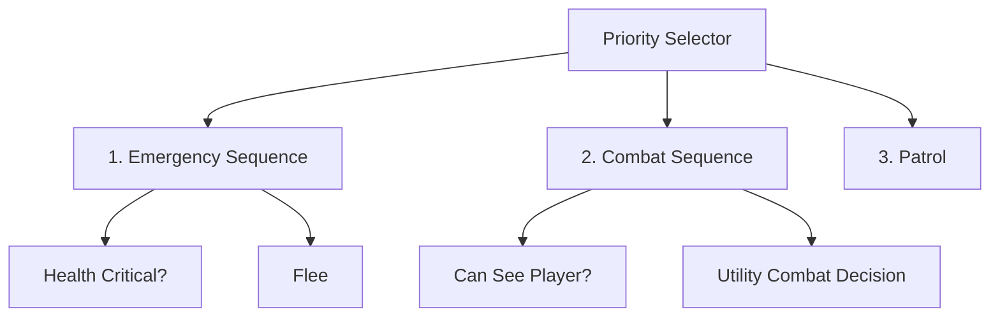

# Slide 1 — Behavior Tree & Utility-Based AI

## Game Cerdas · Pertemuan 6

**Program Studi S1 Teknik Informatika**  
**Konteks implementasi: Unity 6 + C#**

Pengambilan keputusan NPC melalui struktur perilaku dan penilaian aksi.

Lanjutan materi Finite State Machine (FSM).

---

# Slide 2 — Capaian Pembelajaran

Setelah pertemuan ini, mahasiswa mampu:

1. Menjelaskan struktur dan status node Behavior Tree.
2. Mendesain perilaku NPC dengan selector, sequence, decorator, condition, dan action.
3. Menghitung utility score dari kondisi permainan.
4. Membandingkan FSM, Behavior Tree, dan Utility AI.
5. Merancang serta mengevaluasi NPC berbasis BT atau Utility AI di Unity.

---

# Slide 3 — Review FSM dan Tantangan Kompleksitas

FSM mengatur **state aktif** serta kondisi perpindahannya.

Contoh perilaku: **Patrol, Chase, Attack, Flee**.

- Cocok untuk sedikit state dengan transisi yang jelas.
- Penambahan Heal, Reload, Search, dan TakeCover memperbanyak hubungan antarkeadaan.
- Kombinasi state dan kondisi dapat membuat diagram sulit dikelola.
- Hierarchical FSM membantu mengelompokkan state. BT dan Utility AI menawarkan cara pengorganisasian keputusan yang berbeda.

**Pertanyaan utama:** bagaimana menambah perilaku tanpa membuat aturan sulit ditelusuri?

---

# Slide 4 — Posisi Decision Making dalam Game AI

| Komponen | Tanggung jawab | Contoh |
|---|---|---|
| Perception | Mengamati lingkungan | Melihat player melalui sensor |
| Memory / Blackboard | Menyimpan konteks NPC | Posisi terakhir player |
| Decision Making | Menentukan perilaku | Memilih Chase atau Flee |
| Navigation / Movement | Menggerakkan NPC | Mencari jalur dan mengikuti target |
| Action / Animation | Menjalankan interaksi | Menyerang dan memainkan animasi |

**Behavior Tree dan Utility AI berada pada komponen decision making.** Keduanya menggunakan data sensor dan mengarahkan sistem pelaksana aksi.

---

# Slide 5 — Konsep Behavior Tree

**Behavior Tree (BT)** menyusun perilaku agent sebagai hierarki node.

- Evaluasi dimulai dari **root**.
- Node pengatur alur memilih atau mengurutkan child.
- Node paling bawah memeriksa kondisi atau menjalankan aksi.
- Setiap node mengembalikan status kepada parent.
- Subtree dapat digunakan kembali untuk perilaku seperti menyerang, mencari, atau berlindung.

**Contoh:** subtree Attack memeriksa visibilitas dan jarak sebelum menjalankan serangan.

---

# Slide 6 — Success, Failure, dan Running

| Status | Makna | Contoh |
|---|---|---|
| Success | Kondisi terpenuhi atau aksi selesai | NPC sampai di waypoint |
| Failure | Kondisi tidak terpenuhi atau aksi gagal | Player tidak terlihat |
| Running | Aksi masih berlangsung | NPC sedang menuju waypoint |

Condition sederhana biasanya mengembalikan **Success/Failure**.

Action yang membutuhkan waktu dapat mengembalikan **Running** selama beberapa tick.

**Aksi yang terpilih belum tentu selesai.** Chase yang sedang berjalan dapat membuat seluruh cabangnya berstatus Running.

---

# Slide 7 — Root, Tick, dan Evaluasi Ulang

**Tick** adalah satu proses evaluasi tree dari root.

1. Baca konteks NPC yang sudah diperbarui.
2. Evaluasi node sesuai aturan parent.
3. Jalankan atau lanjutkan aksi yang memenuhi kondisi.
4. Kembalikan status ke parent.

Tree dapat dievaluasi setiap frame atau pada interval tertentu, misalnya **0,2 detik** sebagai titik awal eksperimen.

Frekuensi keputusan memengaruhi respons dan biaya komputasi. Gerak serta animasi tetap dapat diperbarui setiap frame.

---

# Slide 8 — Jenis Node Behavior Tree

| Kelompok | Node | Fungsi |
|---|---|---|
| Root | Root | Titik masuk evaluasi |
| Composite | Selector | Mencoba alternatif berdasarkan urutan |
| Composite | Sequence | Menjalankan urutan syarat atau langkah |
| Decorator | Inverter, Cooldown, Repeat | Memodifikasi evaluasi satu child |
| Leaf | Condition | Memeriksa keadaan |
| Leaf | Action | Menjalankan perilaku |

Composite mengelola beberapa child. Decorator memiliki satu child. Leaf tidak memiliki child.

---

# Slide 9 — Selector: Pemilihan Alternatif

**Selector** mengevaluasi child sesuai urutan prioritas.

- **Failure:** coba child berikutnya.
- **Success:** hentikan evaluasi dan kembalikan Success.
- **Running:** hentikan evaluasi tick ini dan kembalikan Running.
- Jika semua child Failure, selector mengembalikan Failure.

Contoh urutan: **Flee, Attack, Chase, Patrol**.

Setiap cabang perlu kondisi yang sesuai. Menaruh aksi Flee tanpa syarat di urutan pertama dapat membuat cabang lain tidak pernah dijalankan.

---

# Slide 10 — Sequence: Syarat dan Urutan Aksi

**Sequence** mengevaluasi child secara berurutan.

- **Success:** lanjut ke child berikutnya.
- **Failure:** hentikan evaluasi dan kembalikan Failure.
- **Running:** hentikan evaluasi tick ini dan kembalikan Running.
- Jika semua child Success, sequence mengembalikan Success.

Contoh Sequence Attack:

1. `CanSeePlayer?`
2. `InAttackRange?`
3. `AttackPlayer`

Serangan hanya dimulai jika kedua kondisi terpenuhi.

---

# Slide 11 — Selector vs Sequence

| Status child | Selector | Sequence |
|---|---|---|
| Success | Berhenti: Success | Lanjut ke child berikutnya |
| Failure | Lanjut ke child berikutnya | Berhenti: Failure |
| Running | Berhenti: Running | Berhenti: Running |
| Seluruh child selesai | Failure jika semuanya gagal | Success jika semuanya berhasil |

**Selector** memilih alternatif. **Sequence** menyusun syarat dan langkah.

Analogi OR dan AND membantu memahami kondisi biner, tetapi BT juga menangani aksi yang masih **Running**.

---

# Slide 12 — Condition dan Action Node

| Aspek | Condition | Action |
|---|---|---|
| Tujuan | Memeriksa syarat | Melakukan pekerjaan |
| Contoh | HealthLow, CanSeePlayer | Patrol, Attack, Flee |
| Status umum | Success / Failure | Success / Failure / Running |
| Sumber data | Blackboard atau context | Context dan komponen pelaksana |

Contoh `MoveToTarget`:

- **Running** ketika masih bergerak.
- **Success** ketika sampai.
- **Failure** ketika tujuan tidak dapat dicapai.

Pisahkan pemeriksaan kondisi dari aksi agar node mudah digunakan kembali.

---

# Slide 13 — Decorator: Inverter, Cooldown, dan Repeat

Decorator mengubah evaluasi **satu child**.

| Decorator | Perilaku | Contoh |
|---|---|---|
| Inverter | Menukar Success dan Failure, mempertahankan Running | Kondisi player tidak terlihat |
| Cooldown | Membatasi kapan child boleh mulai kembali | Jeda serangan 1,5 detik |
| Repeat | Mengulang child sesuai aturan pengulangan | Mengulangi patroli |
| Timeout | Membatasi durasi child | Search maksimal beberapa detik |

Tentukan aturan status saat cooldown belum siap. Repeat juga membutuhkan mekanisme interupsi jika perilaku prioritas lebih tinggi harus mengambil alih.

---

# Slide 14 — Blackboard dan Perception

**Blackboard** menyimpan konteks yang digunakan bersama oleh node.

| Data | Penggunaan |
|---|---|
| `canSeePlayer` | Syarat Attack atau Chase |
| `distanceToPlayer` | Pemeriksaan jarak |
| `health` | Syarat Flee |
| `lastSeenPosition` | Tujuan Search |
| `attackReady` | Kesiapan memulai serangan |
| `currentWaypoint` | Tujuan Patrol |

Perception memperbarui data sensor sebelum tree dievaluasi. Condition membaca data tersebut, sedangkan action menggunakan konteks untuk menjalankan perilaku.

---

# Slide 15 — Desain Behavior Tree Enemy

Root menjalankan **priority selector** dengan cabang berikut, berurutan dari atas ke bawah.

| Prioritas | Cabang | Syarat | Aksi |
|---:|---|---|---|
| 1 | Sequence Flee | HP rendah dan ancaman relevan | Menuju tempat aman |
| 2 | Sequence Attack | Player terlihat dan dalam jangkauan | Menyerang saat siap |
| 3 | Sequence Chase | Player terlihat | Mendekati player |
| 4 | Patrol | Fallback | Mengikuti waypoint |

Setiap baris bersyarat menjadi subtree Sequence. Attack dapat menunggu cooldown sambil mempertahankan posisi tempur.

---

# Slide 16 — Penelusuran Satu Tick

Contoh evaluasi tree pada slide sebelumnya:

| Kondisi | Cabang yang gagal | Aksi terpilih |
|---|---|---|
| HP rendah, ada ancaman | Tidak ada sebelum Flee | Flee |
| HP normal, player terlihat dan dekat | Flee | Attack |
| HP normal, player terlihat dan jauh | Flee, Attack | Chase |
| Tidak ada ancaman atau target terlihat | Flee, Attack, Chase | Patrol |

Jika Chase masih bergerak, **Chase, Sequence Chase, dan selector** mengembalikan Running pada tick tersebut.

---

# Slide 17 — Running, Memory, dan Interupsi

Aturan melanjutkan child berbeda menurut implementasi composite.

- **Reactive:** mengevaluasi ulang child awal pada tick berikutnya sehingga kondisi prioritas tinggi dapat diperiksa kembali.
- **Memory:** menyimpan posisi child Running dan melanjutkannya pada tick berikutnya.
- Saat aksi berganti, hentikan aksi lama melalui mekanisme **abort/exit** yang sesuai.
- Hindari mengulang efek seperti damage atau memulai animasi setiap tick.

Untuk enemy pada contoh ini, evaluasi reaktif membantu Flee mengambil alih Chase saat HP menjadi rendah.

---

# Slide 18 — Memory NPC dan Search

NPC dapat mencari player yang baru menghilang dari penglihatan.

1. Saat melihat player, simpan `lastSeenPosition` dan waktu pengamatan.
2. Setelah kehilangan player, gunakan posisi terakhir sebagai tujuan Search.
3. Batasi waktu pencarian.
4. Hapus status target terakhir setelah pencarian selesai atau kedaluwarsa.

Urutan cabang menjadi **Flee, Attack, Chase, Search, Patrol**.

**Memory NPC** menyimpan informasi dunia. Istilah ini berbeda dari **memory composite**, yang menyimpan indeks child Running.

---

# Slide 19 — Struktur Dasar BT dalam C#

```csharp
public enum NodeState
{
    Success, Failure, Running
}

public abstract class BTNode
{
    public abstract NodeState Tick();
    public virtual void Abort() { }
}
```

- `SelectorNode` dan `SequenceNode` menyimpan child.
- `ConditionNode` mengubah hasil pemeriksaan menjadi status.
- `ActionNode` mengelola proses aksi.
- `Abort()` memberi tempat untuk membersihkan aksi yang terinterupsi.

Ini adalah kerangka konsep untuk dikembangkan dalam praktikum.

---

# Slide 20 — Logika Selector dan Sequence dalam C#

Potongan metode berikut menggunakan koleksi `children` yang sudah diinisialisasi.

**Selector:**

```csharp
foreach (BTNode child in children)
{
    NodeState result = child.Tick();
    if (result != NodeState.Failure) return result;
}
return NodeState.Failure;
```

**Sequence:**

```csharp
foreach (BTNode child in children)
{
    NodeState result = child.Tick();
    if (result != NodeState.Success) return result;
}
return NodeState.Success;
```

Contoh ini mengevaluasi dari child pertama setiap tick. Implementasi lengkap perlu melacak dan membatalkan child aktif ketika cabang berganti.

---

# Slide 21 — Integrasi BT dengan Unity

| Komponen | Peran dalam NPC |
|---|---|
| `MonoBehaviour` | Mengatur pembaruan sensor dan tick |
| `Transform`, `Vector3` | Posisi target, arah, dan jarak |
| `Raycast`, `LayerMask` | Memeriksa pandangan dan penghalang |
| `NavMeshAgent` | Menjalankan navigasi Patrol, Chase, dan Flee |
| `Animator` | Menjalankan animasi aksi |

Contoh perintah Chase: `agent.SetDestination(targetPosition)`.

Attack dapat menghentikan gerak dengan `agent.isStopped = true`. Aksi gerak berikutnya perlu mengaktifkannya kembali. Damage harus mengikuti siklus serangan, bukan setiap tick keputusan.

---

# Slide 22 — Kekuatan, Batasan, dan Debugging BT

**Kekuatan:** perilaku modular, prioritas terbaca, condition dan action dapat digunakan kembali.

**Batasan:** tree dapat membesar, urutan cabang memengaruhi perilaku, serta Running dan interupsi memerlukan pengelolaan yang jelas.

Saat debugging, tampilkan:

- Jalur node aktif dan statusnya.
- Condition yang menggagalkan cabang.
- Nilai blackboard dan waktu pembaruannya.
- Pergantian aksi serta pemanggilan abort.

Contoh: `Attack: Failure | Chase: Running`. Periksa kondisi cabang sebelum mengubah prioritas.

---

# Slide 23 — Konsep Utility-Based AI

**Utility-Based AI** menilai kegunaan setiap aksi berdasarkan konteks permainan.

1. Tentukan aksi yang dapat dijalankan.
2. Hitung skor setiap kandidat.
3. Pilih aksi dengan skor tertinggi sesuai aturan stabilisasi.
4. Jalankan aksi dan evaluasi kembali pada interval berikutnya.

Contoh skor: **Attack 0,75**, **Flee 0,90**, **Patrol 0,10**.

NPC memilih **Flee**. Kualitas keputusan bergantung pada rancangan fungsi skor, bukan hanya pemilihan nilai maksimum.

---

# Slide 24 — Kondisi Biner vs Utility Score

| Pendekatan | Contoh | Karakteristik |
|---|---|---|
| Kondisi biner | HP kurang dari 30% berarti Flee | Keputusan berubah pada ambang |
| Utility score | Kebutuhan Flee meningkat ketika HP turun | Menggambarkan tingkat kepentingan |

Utility score memungkinkan beberapa pertimbangan dibandingkan, misalnya kesehatan, ancaman, dan peluang menyerang.

**Skor yang berubah halus belum menjamin aksi berubah halus.** Pemilihan skor tertinggi tetap dapat berganti mendadak ketika dua skor berpotongan.

---

# Slide 25 — Faktor dan Normalisasi Skor

Faktor umum: **health, jarak, ammo, cooldown, cover, jumlah rekan, dan tingkat ancaman**.

Normalisasi membantu membandingkan faktor dengan satuan berbeda.

```csharp
float health01 = Mathf.Clamp01(
    currentHealth / maxHealth);
float nearScore = Mathf.Clamp01(
    1f - distance / referenceDistance);
```

Gunakan pembagian bilangan pecahan. `maxHealth` dan `referenceDistance` harus lebih besar dari nol.

Rentang **0–1** memudahkan interpretasi, tetapi arti skor setiap aksi tetap harus dirancang secara konsisten.

---

# Slide 26 — Response Curve

**Response curve** mengubah input yang telah dinormalisasi menjadi tingkat kepentingan.

Untuk kesehatan relatif `h` pada rentang 0–1:

| Kurva | Contoh rumus | Pengaruh |
|---|---|---|
| Linear menurun | `1 − h` | Urgensi naik sebanding penurunan HP |
| Kuadratik | `(1 − h)²` | Urgensi lebih terkonsentrasi saat HP rendah |
| Threshold | `h < 0,3 ? 1 : 0` | Perubahan tegas pada ambang |

Pilih bentuk kurva berdasarkan perilaku yang diinginkan. Kurva kustom memungkinkan perubahan sensitivitas pada rentang tertentu.

---

# Slide 27 — Contoh Perhitungan Skor Flee

Contoh dasar dengan HP maksimum 100:

**`lowHealthScore = 1 − healthPercent`**

| HP | Health relatif | Low-health score |
|---:|---:|---:|
| 100 | 1,00 | 0,00 |
| 70 | 0,70 | 0,30 |
| 40 | 0,40 | 0,60 |
| 10 | 0,10 | 0,90 |

Agar NPC tidak kabur tanpa ancaman, tambahkan konteks:

**`fleeScore = lowHealthScore × threatNearScore`**

Jika tidak ada ancaman relevan, `threatNearScore = 0`.

---

# Slide 28 — Contoh Skor Jarak dan Kelayakan Attack

Dengan jarak referensi **10 unit**:

**`nearScore = Clamp01(1 − distance / 10)`**

| Jarak | Near score |
|---:|---:|
| 1 | 0,90 |
| 3 | 0,70 |
| 6 | 0,40 |
| 10 | 0,00 |

Skor kedekatan belum menentukan apakah serangan dapat dijalankan.

Untuk serangan melee berjangkauan **2 unit**, target pada jarak 3 tetap tidak layak diserang walaupun near score bernilai 0,70. Periksa jangkauan, visibilitas, dan kesiapan serangan sebagai syarat wajib.

---

# Slide 29 — Penggabungan Faktor dengan Perkalian

Contoh skor Attack:

**`Attack = nearScore × visible × inRange × ready`**

- `nearScore` menggambarkan preferensi kedekatan.
- `visible`, `inRange`, dan `ready` bernilai 0 atau 1.
- Jika salah satu syarat wajib bernilai 0, hasil perkalian menjadi 0.
- Banyak faktor pecahan dapat membuat skor menjadi sangat kecil.

**Kelayakan tetap perlu diperiksa saat seleksi.** Skor nol saja belum mencegah aksi tidak valid terpilih ketika seluruh kandidat bernilai nol.

---

# Slide 30 — Weighted Sum dan Syarat Wajib

Weighted sum menggabungkan pertimbangan yang dapat saling mengimbangi.

**`preference = 0,6 × nearScore + 0,4 × aggressionScore`**

Untuk input 0–1 dan bobot nonnegatif berjumlah 1, hasil juga berada pada rentang 0–1.

Contoh Attack:

**`Attack = eligible × preference`**

`eligible` bernilai 1 hanya jika target terlihat, dalam jangkauan, dan serangan siap.

**Visibility yang wajib tidak cukup dijadikan salah satu suku penjumlahan.** Faktor lain dapat menghasilkan skor tinggi meskipun player tidak terlihat.

---

# Slide 31 — Model Skor Enemy untuk Latihan

Gunakan model ilustratif berikut secara konsisten pada contoh berikutnya.

| Simbol | Definisi |
|---|---|
| `h` | Health relatif, 0–1 |
| `n` | `Clamp01(1 − distance / 10)` |
| `v` | Player terlihat: 1 atau 0 |
| `r` | Dalam jarak serang 2 unit: 1 atau 0 |
| `c` | Serangan siap: 1 atau 0 |

| Aksi | Rumus skor | Syarat kandidat |
|---|---|---|
| Attack | `v × r × c × n` | `v = r = c = 1` |
| Chase | `v × (1 − r) × (1 − n)` | Player terlihat dan di luar jarak serang |
| Flee | `(1 − h) × v × n` | Ada ancaman terlihat dan rute aman |
| Patrol | `0,10` | Jalur patroli tersedia |

Model ini menyederhanakan ancaman menjadi player terlihat dan dekat. Tuning diperlukan untuk perilaku permainan sebenarnya.

---

# Slide 32 — Simulasi Keputusan Utility AI

Gunakan rumus slide sebelumnya. Asumsikan rute aman dan patroli tersedia.

| Skenario | Attack | Chase | Flee | Patrol | Pilihan |
|---|---:|---:|---:|---:|---|
| HP 80%, jarak 1, terlihat, siap | 0,90 | Tidak layak | 0,18 | 0,10 | Attack |
| HP 20%, jarak 1, terlihat, cooldown | Tidak layak | Tidak layak | 0,72 | 0,10 | Flee |
| HP 80%, jarak 8, terlihat, siap | Tidak layak | 0,80 | 0,04 | 0,10 | Chase |
| HP 80%, target tidak terlihat | Tidak layak | Tidak layak | Tidak layak | 0,10 | Patrol |

Pada HP 20% dengan serangan siap, Attack masih dapat mengungguli Flee dalam model ini. Jika Flee harus mendominasi, ubah kurva/bobot atau tambahkan aturan darurat.

---

# Slide 33 — Utility Action dan Algoritma Seleksi

Setiap action menyediakan **CanExecute**, **CalculateScore**, dan fungsi pelaksanaan aksi.

```text
bestAction = null
bestScore = -infinity
for each action:
    if not action.CanExecute(context): continue
    score = action.CalculateScore(context)
    if score > bestScore:
        bestScore = score
        bestAction = action
if bestAction is null:
    bestAction = safeFallback
ApplyDecision(bestAction)
```

`ApplyDecision` mengelola pergantian aksi. Gunakan aturan tie-break yang konsisten, misalnya mempertahankan aksi aktif ketika skor sama dan aksi masih valid.

---

# Slide 34 — Fallback dan Siklus Hidup Aksi

**Fallback** memastikan NPC tetap memiliki perilaku ketika kandidat utama tidak layak.

- Patrol dapat memiliki skor dasar, misalnya **0,10**.
- Jika jalur patroli tidak tersedia, gunakan Idle yang aman.
- **Enter:** menyiapkan aksi saat pertama terpilih.
- **Update/Tick:** melanjutkan aksi yang sedang berjalan.
- **Exit/Abort:** membersihkan aksi saat selesai atau berganti.

Jangan memanggil Enter ulang pada setiap evaluasi skor. Memulai animasi atau mereset tujuan terus-menerus dapat menghambat penyelesaian aksi.

---

# Slide 35 — Switching, Hysteresis, dan Commitment

Skor yang hampir sama dapat membuat NPC sering berganti aksi.

Contoh: Attack **0,51** dan Chase **0,50**, lalu urutannya berbalik.

| Teknik | Aturan contoh |
|---|---|
| Hysteresis | Ganti jika skor baru melampaui skor aktif lebih dari 0,10 |
| Minimum duration | Pertahankan aksi setidaknya 1 detik |
| Decision interval | Evaluasi keputusan setiap 0,2 detik |
| Action commitment | Selesaikan bagian penting animasi sebelum berganti |

Angka tersebut merupakan titik awal tuning. Kondisi darurat atau aksi yang tidak valid harus dapat menginterupsi komitmen.

---

# Slide 36 — Personality dan Konfigurasi di Unity

Bobot dan kurva dapat menghasilkan karakter NPC berbeda.

| Karakter | Penyesuaian |
|---|---|
| Agresif | Preferensi Attack lebih tinggi |
| Penakut | Urgensi Flee meningkat lebih cepat |
| Defensif | Preferensi TakeCover lebih tinggi |

Gunakan `[SerializeField]` untuk membuka parameter di Inspector. `ScriptableObject` dapat menyimpan konfigurasi aksi dan kurva yang digunakan bersama.

Simpan **status runtime per NPC**, seperti cooldown dan aksi aktif, secara terpisah dari asset konfigurasi bersama. Praktikum awal cukup menggunakan class C# biasa.

---

# Slide 37 — Debugging dan Kesalahan Utility AI

Tampilkan **aksi aktif, kandidat yang layak, skor setiap faktor, skor akhir, serta alasan pergantian aksi**.

| Gejala | Hal yang diperiksa |
|---|---|
| Attack menembus penghalang | Validasi visibilitas |
| Flee saat tidak ada ancaman | Faktor ancaman pada skor Flee |
| Aksi berganti terlalu cepat | Hysteresis dan commitment |
| Satu aksi selalu menang | Skala skor, bobot, dan kurva |
| NPC tidak bertindak | Kelayakan kandidat dan fallback |

Gunakan Console, UI debug, Inspector, atau Gizmos. Catat pergantian aksi agar evaluasi tidak bergantung hanya pada kesan visual.

---

# Slide 38 — Pemilihan FSM, BT, dan Utility AI

| Aspek | FSM | Behavior Tree | Utility AI |
|---|---|---|---|
| Dasar keputusan | State dan transisi | Alur evaluasi node | Perbandingan skor |
| Kekuatan | State aktif jelas | Perilaku modular | Banyak pertimbangan |
| Tantangan | Transisi bertambah | Tree dan interupsi kompleks | Desain skor dan stabilitas |
| Pilihan penggunaan | Mode sederhana | Guard dengan prioritas jelas | Combat dengan banyak alternatif |

Gunakan struktur yang sesuai kebutuhan. Respons berbasis konteks pada Utility AI tidak otomatis berarti NPC belajar melalui machine learning.

---

# Slide 39 — Kombinasi Behavior Tree dan Utility AI

Contoh BT dengan Utility AI di dalam cabang combat:



Utility Combat Decision menilai **Attack, Chase, dan TakeCover**. BT menjaga prioritas darurat, sedangkan Utility AI membandingkan pilihan combat yang layak.

Node utility tetap perlu mengembalikan status BT dan menangani interupsi aksi aktif.

---

# Slide 40 — Praktikum: NPC dengan BT atau Utility AI

**Target bersama:** NPC dapat Patrol, Chase, Attack, dan Flee.

| Pilihan | Fokus implementasi | Bukti perilaku |
|---|---|---|
| A. Behavior Tree | Node dasar, selector, sequence, condition, action | Status node dan cabang aktif |
| B. Utility AI | Kelayakan aksi, fungsi skor, seleksi, stabilisasi | Skor kandidat dan aksi terpilih |
| Pengayaan hybrid | BT untuk prioritas, Utility untuk combat | Aturan darurat dan skor combat |

Mulai dari satu pendekatan, lalu gunakan scene yang sama untuk perbandingan. Langkah teknis lengkap mengikuti modul praktikum terpisah.

---

# Slide 41 — Scene dan Parameter Praktikum

Scene memuat **ground dengan NavMesh, player, enemy, obstacle, waypoint, safe point, kamera, dan UI debug**.

| Parameter | Nilai awal contoh |
|---|---:|
| Vision range / attack range | 10 / 2 unit |
| Max health / low-health threshold | 100 / 30 |
| Attack cooldown | 1,5 detik |
| Safe distance | 12 unit |
| Patrol / chase / flee speed | 2 / 4 / 5 unit per detik |
| Decision interval | 0,2 detik |

Untuk Utility AI, tambahkan bobot aksi, kurva, hysteresis, dan minimum duration. Nilai awal perlu disesuaikan dengan skala scene dan tujuan perilaku.

---

# Slide 42 — Skenario Pengujian dan Evaluasi

| Pengujian | Hal yang diamati |
|---|---|
| Player masuk dan keluar pandangan | Respons Patrol, Chase, atau Search |
| Player melintasi batas jarak serang | Pergantian Chase dan Attack |
| HP turun saat NPC menyerang | Respons Flee sesuai aturan/skor |
| Cooldown belum selesai | Tidak ada damage berulang |
| Dua skor hampir sama | Stabilitas aksi |
| Jalur terhalang atau tujuan tidak valid | Failure dan fallback |

Catat aksi terpilih, alasan keputusan, waktu respons, dan jumlah pergantian aksi dalam durasi uji yang sama.

---

# Slide 43 — Eksperimen dan Latihan Konsep

**Behavior Tree:** rancang guard dengan prioritas Flee, Attack, Chase, Search, dan Patrol. Tentukan condition, action, serta decorator yang diperlukan.

**Utility AI:** tambahkan TakeCover. Tentukan syarat kelayakan, faktor skor, dan cara membandingkannya dengan aksi lain.

Eksperimen:

1. Ubah prioritas BT dan amati kasus yang berubah.
2. Ubah bobot Attack/Flee untuk dua kepribadian NPC.
3. Bandingkan frekuensi switching sebelum dan sesudah hysteresis.
4. Jelaskan keputusan kedua pendekatan ketika HP 20%, player dekat, dan serangan siap.

---

# Slide 44 — Ringkasan dan Pertanyaan Diskusi

**Behavior Tree:** struktur node, evaluasi prioritas, serta status Success, Failure, dan Running.

**Utility AI:** kandidat aksi, faktor/kurva skor, pemilihan aksi, serta stabilisasi keputusan.

Pertanyaan diskusi:

1. Apa yang terjadi pada selector dan sequence ketika child Running?
2. Bagaimana aksi prioritas tinggi menginterupsi Chase?
3. Mengapa syarat wajib berbeda dari preferensi berbobot?
4. Mengapa normalisasi belum menjamin skor antaraksi seimbang?
5. Kapan hybrid BT dan Utility AI memberi manfaat?

---

# Slide 45 — Materi Berikutnya: Game AI Integration & Tactical AI

Pertemuan berikutnya menghubungkan keputusan NPC dengan perilaku taktis.

- Integrasi perception, memory, dan decision making.
- Hubungan keputusan dengan pathfinding serta movement.
- Tactical positioning dan cover selection.
- Koordinasi antar-agent.

**Bekal utama:** NPC harus dapat menjelaskan pilihannya melalui kondisi atau skor, menjalankan aksi secara konsisten, dan merespons perubahan situasi.
